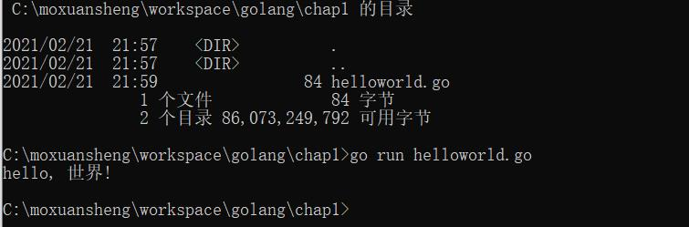

# 说明
本项目为Go语言学习。对于基本语法、语言特性、包、调试以及测试内容进行学习，并结合网络编程对于Go网络服务编写进行使用。

笔者学习Go语言主要基于如下几个方面：

- 发明人中有C语言作者参与，笔者工作中主要开发语言是C语言，对于C语言的改进，或者结合目前互联网服务等环境，看起来Go语言更为适合；
- C++太复杂了；
- Go语言使用排名等在上升，国内一些大厂也在使用，券商行业中广发证券等作为开发语言，生态环境逐渐丰富；
- 

参考书籍为：[The Go Programming Language](http://www.gopl.io/)，Go语言圣经。

# 安装

[官网下载](https://golang.org/dl/) Go1.6版本，笔者在windows环境中安装，一路Next，然后在cmd中运行。


## hello World

一门语言的学习从“hello world”开始，非常亲切。先运行一个“hello world”了解一下基本面。

### 代码结构

运行[hello word程序](chap1/helloworld.go)，得到结果：



程序代码结构看起来非常简单：

```go
package main

import "fmt"

func main() {
    fmt.Println("hello, 世界!");
}

```

- 包的声明、引用

- 定义main方法

- 看起来就像python+C的方式。

  看起简单，那就Next。


# 第二章、语法


