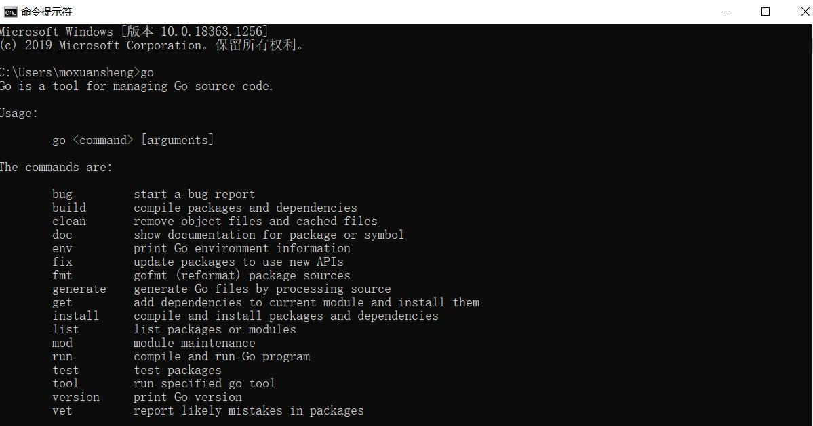
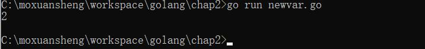
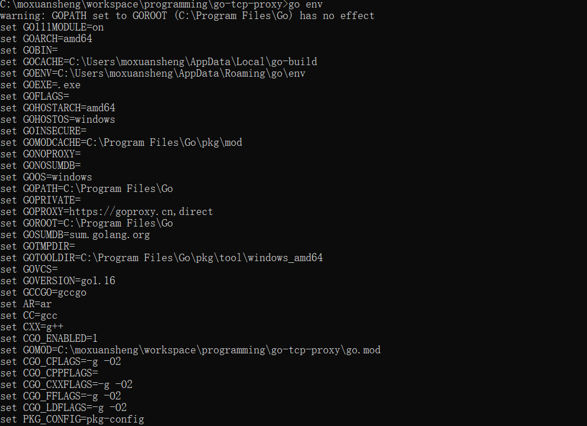
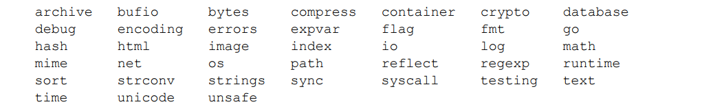

[TOC]

# Go语言学习笔记
记录Go语言学习过程中的点点滴滴，分析部分优秀Go语言开源项目的代码，最后结合笔者的工作经验，对于Go语言在证券行情处理、协议实现等方面进行总结分享。
**the more you share, the more you have**。

# 目录

- [x] [第零章 开场白](chap0)

- [x] [第1章 介绍](chap1) 

- [x] [第2章 语法](chap2)

- [x] [第3章 基础类型](chap3)

- [x] [第4章 复合类型](cha4)

- [x] [第5章 函数](chap5)

- [x] [第6章 方法](chap6)

- [x] [第7章 接口](chap7)

- [x] [第8章 Goroutines](chap8)

- [x] [第9章 共享变量][chap9]

- [x] [第10章 包管理](chap10)

- [x] [第11章 测试](chap11)

- [x] [第12章 反射](chap12)

- [x] [第13章 标准库](chap13)

- [x] [第14章 网络编程](chap14)

- [x] [第15章 web编程](chap15)
# 说明

本项目为Go语言学习。对于基本语法、语言特性、包、调试以及测试内容进行学习，并结合网络编程对于Go网络服务编写进行使用。

笔者学习Go语言主要基于如下几个方面：

- 发明人中有C语言作者参与，笔者工作中主要开发语言是C语言，对于C语言的改进，或者结合目前互联网服务等环境，看起来Go语言更为适合；
- C++太复杂了；
- Go语言使用排名等在上升，国内一些大厂也在使用，券商行业中广发证券等作为开发语言，生态环境逐渐丰富；
- 在快速开发和执行速度之间架起了桥梁。

## 特性

- Go语言定义了能做什么，还定义了不能做什么；

- 语法简洁，便于记忆；
- Go语言编译器速度非常快，显著减少项目构建的时间；
- 内置并发机制，不用使用特定的线程库，即：协程机制；
- 自带垃圾回收机制，不需要用户自己管理内存。

## 开发速度

Go 语言使用了更加智能的编译器，并简化了解决依赖的算法，最终提供了更快的编译速度。 编译 Go 程序时，编译器只会关注那些直接被引用的库，而不是像 Java、C 和 C++那样，要遍历 依赖链中所有依赖的库。

## 并发

充分利用硬件资源，Go 语言对并发的支持是这门语言最重要的特性之一。

goroutine 很像线程，但是它占用的 内存远少于线程，使用它需要的代码更少。

通道（channel）是一种内置的数据结构，可以让 用户在不同的 goroutine 之间同步发送具有类型的消息。

这让编程模型更倾向于在 goroutine 之间发送消息，而不是让多个 goroutine 争夺同一个数据的使用权。


并发的最难的部分就是要确保其他并发运行的进程、线程或 goroutine 不会意外修改用户的数据。其他语言会通过全局变量或者共享内存，是用复杂锁规则来防止对同一个变量的不同步修改。

通过通道模式保证了同一时刻仅有一个goroutine 修改数据。通过通道在协程之间发送数据，可以完成顺序读取或者修改数据。

需要强调的是，通道并不提供跨 goroutine 的数据访问保护机制。如果通过通道传输数据的一份副本，那么每个 goroutine 都持有一份副本，各自对自己的副本做修改是安全的。**当传输的 是指向数据的指针时，如果读和写是由不同的 goroutine 完成的，每个 goroutine 依旧需要额外的 同步动作。**

## 类型系统
### 类型简单
int、string等内置类型，还支持用户定义的类型。

### Go接口对一组行为建模
接口用于描述类型的行为。
在类型Java严格的面向对象语言中，所有的设计都围绕接口展开。编码之前需要思考庞大的继承链。
```java
interface User {
public void login(); 
public void logout();
}
```

在 Java 中要实现这个接口，要求用户的类必须满足 User 接口里的所有约束，并且显式声 明这个类实现了这个接口。类实现implements 接口，以及所有的约束。

而Go语言的接口一般只会描述一个单一的动作。比如：io.Reader，标准库内的其他函数都能理解这个接口，定义如下：

```go
type Reader interface {
Read(p []byte) (n int, err error) }
```

只需要实现一个Read方法，该方法接收byte切片，返回一个整数和可能出现的错误。

这和传统的面向对象编程语言的接口系统有本质的区别。Go语言的接口更小，只倾向于定义一个单一的动作。

文件、缓冲区、套接字以及其他的数据源 都实现了 io.Reader 接口。使用同一个接口，可以高效地操作数据，而不用考虑到底数据 来自哪里。


## 内存管理

Go语言拥有现代化的垃圾回收机制。C/C++使用之前分配，使用完成之后释放掉。


参考书籍为：

- [The Go Programming Language](http://www.gopl.io/)，Go语言圣经。
- [Go语言实战](https://item.jd.com/12136974.html)，语言实战。

# 安装及介绍

[官网下载](https://golang.org/dl/) Go1.6版本，笔者在windows环境中安装，一路Next，然后在cmd中运行。




## hello World

一门语言的学习从“hello world”开始，非常亲切。先运行一个“hello world”了解一下基本面。

### 代码结构

运行[hello word程序](chap1/helloworld.go)，得到结果：


程序代码结构看起来非常简单：

```go
package main

import "fmt"

func main() {
    fmt.Println("hello, 世界!");
}
```


- 包的声明、引用

- 定义main方法

- 看起来就像python+C的方式。

  看起简单，那就Next。
  


# 第二章、语法

## 2.1 命名

函数名、变量名、常量名等所有的命名，都遵循一个简单的命名规则：一个名字必须以一个字母（Unicode字母）或下划线开头，后面可以跟任意数量的字母、数字或下划线。大写字母和小写字母是不同的：heapSort和Heapsort是两个不同的名字。**区分大小写**

关键字有：

```go
break      default       func     interface   select
case       defer         go       map         struct
chan       else          goto     package     switch
const      fallthrough   if       range       type
continue   for           import   return      var
```

内部定义常量、类型或者函数：

```go
内建常量: true false iota nil

内建类型: int int8 int16 int32 int64
          uint uint8 uint16 uint32 uint64 uintptr
          float32 float64 complex128 complex64
          bool byte rune string error

内建函数: make len cap new append copy close delete
          complex real imag
          panic recover
```


可以定义中重新使用。

在习惯上，Go语言程序员推荐使用 **驼峰式** 命名，当名字由几个单词组成时优先使用大小写分隔，而不是优先用下划线分隔。而像ASCII和HTML这样的缩略词则避免使用大小写混合的写法。

## 2.2 声明

声明语句定义了程序的各种实体对象以及部分或全部的属性。Go语言主要有四种类型的声明语句：var、const、type和func，分别对应变量、常量、类型和函数实体对象的声明。

go源文件中，以包的声明语句开始，说明该源文件是属于哪个包。包声明语句之后是import语句导入依赖的其它包。

比如[测试程序](chap2/bo)，代码如下：

```Go
// Boiling prints the boiling point of water.
package main

import "fmt"

const boilingF = 212.0

func main() {
    var f = boilingF
    var c = (f - 32) * 5 / 9
    fmt.Printf("boiling point = %g°F or %g°C\n", f, c)
    // Output:
    // boiling point = 212°F or 100°C
}
```

其中常量boilingF是在包一级范围声明语句声明的，然后f和c两个变量是在main函数内部声明的声明语句声明的。在包一级声明语句声明的名字可在整个包对应的每个源文件中访问，而不是仅仅在其声明语句所在的源文件中访问。相比之下，局部声明的名字就只能在函数内部很小的范围被访问。

一个函数的声明由一个函数名字、参数列表（由函数的调用者提供参数变量的具体值）、一个可选的返回值列表和包含函数定义的函数体组成。


## 2.3 变量

var声明语句可以创建一个特定类型的变量，然后给变量附加一个名字，并且设置变量的初始值。

```go
var 变量名字 类型 = 表达式
```

**其中“*类型*”或“*= 表达式*”两个部分可以省略其中的一个。如果省略的是类型信息，那么将根据初始化表达式来推导变量的类型信息。如果初始化表达式被省略，那么将用零值初始化该变量。**

 数值类型变量对应的零值是0，布尔类型变量对应的零值是false，字符串类型对应的零值是空字符串，接口或引用类型（包括slice、指针、map、chan和函数）变量对应的零值是nil。

**参照C语言，默认做了零值初始化。**

### 2.3.1 简短变量声明

在函数内部，有一种称为简短变量声明语句的形式可用于声明和初始化局部变量。它以“名字 := 表达式”形式声明变量，变量的类型根据表达式来自动推导。

### 2.3.2 指针

一个指针的值是另一个变量的地址。一个指针对应变量在内存中的存储位置。并不是每一个值都会有一个内存地址，但是对于每一个变量必然有对应的内存地址。通过指针，我们可以直接读或更新对应变量的值，而不需要知道该变量的名字（如果变量有名字的话）。

如果用“var x int”声明语句声明一个x变量，那么&x表达式（取x变量的内存地址）将产生一个指向该整数变量的指针，指针对应的数据类型是`*int`

**在Go语言中，返回函数中局部变量的地址也是安全的。例如下面的代码，调用f函数时创建局部变量v，在局部变量地址被返回之后依然有效，因为指针p依然引用这个变量。**

```go
var p = f()

func f() *int {
    v := 1
    return &v
}
```

### 2.3.3 new函数

另一个创建变量的方法是调用内建的new函数。表达式new(T)将创建一个T类型的匿名变量，初始化为T类型的零值，然后返回变量地址，返回的指针类型为`*T`。

[示例程序](chap2/newvar.go):

```
package main

import "fmt"


func main(){
    p := new(int)
    *p = 2
    fmt.Println(*p)
}
```

**Q：此时通过简短声明？**

运行结果：




## 2.4 赋值

最简单的赋值语句是将要被赋值的变量放在=的左边，新值的表达式放在=的右边。

### 2.4.1 元组赋值

元组赋值是另一种形式的赋值语句，它允许同时更新多个变量的值。在赋值之前，赋值语句右边的所有表达式将会先进行求值，然后再统一更新左边对应变量的值。

## 2.5 类型

**Q: 类型转换**


## 2.6 包和文件

Go语言中的包和其他语言的库或模块的概念类似，目的都是为了支持模块化、封装、单独编译和代码重用。一个包的源代码保存在一个或多个以.go为文件后缀名的源文件中，通常一个包所在目录路径的后缀是包的导入路径。

每个包都对应一个独立的名字空间。


# 第三章、基础数据类型

## 3.1 整数

Go语言的数值类型包括几种不同大小的整数、浮点数和复数。

Go语言同时提供了有符号和无符号类型的整数运算。这里有int8、int16、int32和int64四种截然不同大小的有符号整数类型，分别对应8、16、32、64bit大小的有符号整数，与此对应的是uint8、uint16、uint32和uint64四种无符号整数类型。

还有两种一般对应特定CPU平台机器字大小的有符号和无符号整数int和uint；其中int是应用最广泛的数值类型。这两种类型都有同样的大小，32或64bit，但是我们不能对此做任何的假设；因为不同的编译器即使在相同的硬件平台上可能产生不同的大小。**依赖机器**

还有一种无符号的整数类型uintptr，没有指定具体的bit大小但是足以容纳指针。

### 3.1.1 运算符优先级

Go语言中关于算术运算、逻辑运算和比较运算的二元运算符，它们按照优先级递减的顺序排列：

```go
*      /      %      <<       >>     &       &^
+      -      |      ^
==     !=     <      <=       >      >=
&&
||
```

```go
Precedence    Operator
    5             *  /  %  <<  >>  &  &^
    4             +  -  |  ^
    3             ==  !=  <  <=  >  >=
    2             &&
    1             ||
```


## 3.2 浮点数

Go语言提供了两种精度的浮点数，float32和float64

用Printf函数的%g参数打印浮点数，将采用更紧凑的表示形式打印，并提供足够的精度，但是对应表格的数据，使用%e（带指数）或%f的形式打印可能更合适。所有的这三个打印形式都可以指定打印的宽度和控制打印精度。

** 通过m.n%f 控制打印精度。


math包中除了提供大量常用的数学函数外，还提供了IEEE754浮点数标准中定义的特殊值的创建和测试：正无穷大和负无穷大，分别用于表示太大溢出的数字和除零的结果；还有NaN非数，一般用于表示无效的除法操作结果0/0或Sqrt(-1).


# 第四章、复合数据类型

## 4.1 数组

数组是一个由固定长度的特定类型元素组成的序列，一个数组可以由零个或多个元素组成。类型可以是内置类型，也可以是某个结构类型。

和数组对应的类型是slice，是可以增长和收缩的动态序列。

### 4.1.1 声明和初始化

声明数组时指定存储的数据类型，以及需要存储的元素的数量。通过对应类型的零值进行初始化。

一种快速创建数组并初始化的方式是使用数组字面量：

```go
array := [5]int{10, 20, 30, 40, 50}
```

在数组字面值中，如果在数组的长度位置出现的是“...”省略号，则表示数组的长度是根据初始化值的个数来计算:

```go
array := [...]int{10, 20, 30, 40, 50}
```

### 4.1.2 使用

数组遍历，通过range[返回索引和值](chap3/array.go)：

```go
package main

import "fmt"

func main() {
    var a [3]int
    fmt.Println(a[0])
    fmt.Println(len(a))
    
    for i, v := range a{
        fmt.Printf("%d %d\n", i, v)
    }
}
```


也可以指定一个索引和对应值列表的方式初始化：

```go
type Currency int

const (
    USD Currency = iota // 美元
    EUR                 // 欧元
    GBP                 // 英镑
    RMB                 // 人民币
)

symbol := [...]string{USD: "$", EUR: "€", GBP: "￡", RMB: "￥"}

fmt.Println(RMB, symbol[RMB]) // "3 ￥"
```

Go语言中，数组是一个值，可以进行赋值操作。需要是相同类型，数组变量的类型包括数组长度和每个元素的类型。


### 4.1.3 多维数组

数组本身只有一个维度，不过可以组合多个数组创建多维数组。多维数组很容易管理具有父子关系的数据或者与坐标系相关联的数据。

```go
// 声明一个二维整型数组，两个维度分别存储 4个元素和 2个元素 
var array [4][2]int
// 使用数组字面量来声明并初始化一个二维整型数组
array := [4][2]int{{10, 11}, {20, 21}, {30, 31}, {40, 41}} 
// 声明并初始化外层数组中索引为  1个和  3的元素
array := [4][2]int{1: {20, 21}, 3: {40, 41}} 
// 声明并初始化外层数组和内层数组的单个元素
array := [4][2]int{1: {0: 20}, 3: {1: 41}}
```


**注意第三个赋值类型，指定了单个元素。**
第一个1:做外层的序号，第二0:为内层的序号。


### 4.1.4 函数之间传递数组

在函数之间传递变量，总是以值的方式传递。如果是数组需要完整赋值，开销很大。可以通过传递数组指针。


## 4.2 slice

lice（切片）代表变长的序列，序列中每个元素都有相同的类型。一个slice类型一般写作[]T，其中T代表slice中元素的类型；slice的语法和数组很像，只是没有固定长度而已。

一个slice由三个部分构成：指针、长度和容量，内置的len和cap函数分别返回slice的长度和容量。

### 4.2.1 创建和初始化

**make和切片字面量**

使用内置的make函数，传入长度参数，如果只指定长度，切片的容量和长度相同。

**使用索引声明切片**

```go
months := [...]string{1: "January", /* ... */, 12: "December"}
```

因此一月份是months[1]，十二月份是months[12]。通常，数组的第一个元素从索引0开始，但是月份一般是从1开始的，因此我们声明数组时直接跳过第0个元素，第0个元素会被自动初始化为空字符串。
**使用切片创建切片**
```go
// 创建一个整型切片
// 其长度和容量都是  5个元素
slice := []int{10, 20, 30, 40, 50} // 创建一个新切片
// 其长度为 2个元素，容量为 4个元素 newSlice := slice[1:3]
```


两个切片共享同一段底层数组，但通过不同的切片会看到底层数组的不同部分。

对底层数组容量是  k的切片  slice[i:j]：
- 长度: j - i 
- 容量: k - i 。


### 4.2.2 nil切片

```go
var slice []int
```


函数要求返回一个切片，但是发生异常的时候。 

### 4.2.3 空切片

空切片底层数组包含0个元素，也没有分配任何存储空间。数据库查询返回0个查询结果时。

### 4.2.4 使用

**append函数**
内置的append函数用于向slice追加元素，[参见](chap3/append.go)：

```go
var x []int
x = append(x, 1)
x = append(x, 2, 3)
x = append(x, 4, 5, 6)
x = append(x, x...) // append the slice x
fmt.Println(x)      // "[1 2 3 4 5 6 1 2 3 4 5 6]"
```

需要一个被操作的切片和一个要追加的值。

**迭代切片**
```go
for index, value := range slice {
```
关键字range返回两个值，第一个值是当前迭代到的索引位置，第二个值是该位置对应元素值的一份副本。是返回了副本而不是对该元素的引用。

### 4.2.5 多维切片
声明多维切片：
```go
// 创建一个整型切片的切片
slice := [][]int{{10}, {100, 200}}
```


外层的 切片包括两个元素，每个元素都是一个切片。第一个元素中的切片使用单个整数 10 来初始化， 第二个元素中的切片包括两个整数，即 100 和 200。

### 4.2.6 函数间传递切片

在函数间传递切片就是要在函数间以值的方式传递切片。由于切片的尺寸很小，在函数间复 制和传递切片成本也很低。

```go
// 分配包含  100万个整型值的切片 
slice := make([]int, 1e6)
// 将  slice传递到函数  
foo slice = foo(slice)
// 函数  foo接收一个整型切片，并返回这个切片 
func foo(slice []int) []int {
...
return slice } 
```

在 64 位架构的机器上，一个切片需要 24 字节的内存：指针字段需要 8  字节，长度和容量字段分别需要 8 字节。

因为切片关联的数据包含在底层数组里面，不属于切片本身，所以将切片 复制到任意函数的时候，对底层数组大小都不会有影响。

## 4.3 Map类型

哈希表是一种巧妙并且实用的数据结构。它是一个无序的key/value对的集合，**其中所有的key都是不同的**，然后通过给定的key可以在常数时间复杂度内检索、更新或删除对应的value。

一个map就是一个哈希表的引用，map类型可以写为map[K]V，其中K和V分别对应key和value。map中所有的key都有相同的类型，所有的value也有着相同的类型，但是key和value之间可以是不同的数据类型。

### 4.3.1 创建和初始化

**使用make声明映射**

```go
ages := make(map[string]int) // mapping from strings to ints
ages := map[string]int{
    "alice":   31,
    "charlie": 34,
}
```

映射的值可以是任何值。可以是内置类型，可以是结构类型，只要这个值可以使用==运算符进行比较。

**使用切片作为映射的值**

```go
// 创建一个映射，使用字符串切片作为值 
dict := map[int][]string{}
```


## 4.3.2 使用映射


使用内置的delete函数可以删除元素：

```go
delete(ages, "alice")
```


从映射取值时有两个选择。第一个选择是，可以同时获得值以及一个表示这个键是否存在的标志。

```go
value, exist := ages["alice"]
//这个键存在吗？
if exist {

}
```

另外一个选择是，只返回键对应的值，然后通过这个值是不是零值来确定键是否存在。

```go
value, exist := ages["alice"]
//这个键存在吗？
if value != "" {
    
}
```

通过关键字range迭代映射里面的所有值，返回的是键值对。


### 4.3.1 函数间传递映射

在函数间传递映射并不会制造出该映射的一个副本。当传递映射给一个函数，并对这个映射做了修改时，所有对这个映射的引用都会觉察到这个修改。


## 4.4 结构体

结构体是一种聚合的数据类型，是由零个或多个任意类型的值聚合成的实体。每个值称为结构体的成员。

下面两个语句声明了一个叫Employee的命名的结构体类型，并且声明了一个Employee类型的变量dilbert：

```go
type Employee struct {
    ID        int
    Name      string
    Address   string
    DoB       time.Time
    Position  string
    Salary    int
    ManagerID int
}

var dilbert Employee
```

结构体变量的成员可以通过点操作符访问.

结构体指针:

```go
var employeeOfTheMonth *Employee = &dilbert
```

### 4.4.1 结构体字面值

结构体值也可以用结构体字面值表示，结构体字面值可以指定每个成员的值。

```go
type Point struct{ X, Y int }

p := Point{1, 2}
```


### 4.4.2 结构体比较

如果结构体的全部成员都是可以比较的，那么结构体也是可以比较的，那样的话两个结构体将可以使用==或!=运算符进行比较。


### 4.4.3 结构体嵌入和匿名成员


### 4.4.4 结构体变量赋值

可以通过键值的方式，通过":"分隔。结构体字面值：

```go
user{
    name:      "Lisa",
    email:     "lisa@email.com",
    ext:       123,
    privileged: true, 
    }
```

对于字段的声明顺序没有要求。

不使用字段名称，创建结构类型的值。

```go
lisa := user{"Lisa", "lisa@email.com", 123, true}
```

结尾不需要逗号，但是值的顺序需要和结构体中声明的字段顺序一致。

使用其他结构类型声明字段

```go
// admin需要一个  user类型作为管理者，并附加权限
type admin struct {
   person user
   level string 
 }
```

为了初始化person，创建user结构类型，并赋给person字段。

## 4.5 JSON

JSON是对JavaScript中各种类型的值——字符串、数字、布尔值和对象——Unicode本文编码。它可以用有效可读的方式表示第三章的基础数据类型和本章的数组、slice、结构体和map等聚合数据类型。

```go
type Movie struct {
    Title  string
    Year   int  `json:"released"`
    Color  bool `json:"color,omitempty"`
    Actors []string
}

var movies = []Movie{
    {Title: "Casablanca", Year: 1942, Color: false,
        Actors: []string{"Humphrey Bogart", "Ingrid Bergman"}},
    {Title: "Cool Hand Luke", Year: 1967, Color: true,
        Actors: []string{"Paul Newman"}},
    {Title: "Bullitt", Year: 1968, Color: true,
        Actors: []string{"Steve McQueen", "Jacqueline Bisset"}},
    // ...
}
```

这样的数据结构特别适合JSON格式，并且在两者之间相互转换也很容易。将一个Go语言中类似movies的结构体slice转为JSON的过程叫编组（marshaling）。编组通过调用json.Marshal函数完成：

```go
data, err := json.Marshal(movies)
if err != nil {
    log.Fatalf("JSON marshaling failed: %s", err)
}
fmt.Printf("%s\n", data)
```

## 4.6 文本和HTML模板

一个模板是一个字符串或一个文件，里面包含了一个或多个由双花括号包含的`{{action}}`对象。

actions部分将触发其它的行为。下面是一个简单的模板字符串:

```go
const templ = `{{.TotalCount}} issues:
{{range .Items}}----------------------------------------
Number: {{.Number}}
User:   {{.User.Login}}
Title:  {{.Title | printf "%.64s"}}
Age:    {{.CreatedAt | daysAgo}} days
{{end}}`
```

模板中`{{range .Items}}`和`{{end}}`对应一个循环action，因此它们之间的内容可能会被展开多次，循环每次迭代的当前值对应当前的Items元素的值。

在一个action中，`|`操作符表示将前一个表达式的结果作为后一个函数的输入，类似于UNIX中管道的概念。


## 4.7 嵌入类型

Go 语言允许用户扩展或者修改已有类型的行为。嵌入类 型是将已有的类型直接声明在新的结构类型里。被嵌入的类型被称为新的外部类型的内部类型。

结构体基于字段名称和字段类型，也可以只有字段类型，这种声明方式称为类型嵌入。

```go
type Base struct {
  b int
}


type Container struct {     // Container is the embedding struct
  Base                      // Base is the embedded struct
  c string
}
```


Container实例也包含了字段b，称为提升类型（*promoted* field），直接访问：

```go
co := Container{}
co.b = 1
co.c = "string"
fmt.Printf("co -> {b: %v, c: %v}\n", co.b, co.c)
```

co.b格式为了语法便利，可以通过co.Base.b访问。

嵌入的结构体仍然可以使用方法：

```go
func (base Base) Describe() string {
  return fmt.Sprintf("base %d belongs to us", base.b)
}
```

可以通过Container的实例访问：

```go
fmt.Println(cc.Describe())
```


https://go101.org/article/type-embedding.html


https://eli.thegreenplace.net/2020/embedding-in-go-part-1-structs-in-structs/


# 第五章、函数

函数可以让我们将一个语句序列打包为一个单元，然后可以从程序中其它地方多次调用。函数的机制可以让我们将一个大的工作分解为小的任务，这样的小任务可以让不同程序员在不同时间、不同地方独立完成。

## 5.1 函数声明

函数声明包括函数名、形式参数列表、返回值列表（可省略）以及函数体。

```go
func name(parameter-list) (result-list) {
    body
}
```

形式参数列表描述了函数的参数名以及参数类型。这些参数作为局部变量，其值由参数调用者提供。**传值，传地址?**

正如hypot一样，如果一组形参或返回值有相同的类型，我们不必为每个形参都写出参数类型。下面2个声明是等价的：

```go
func f(i, j, k int, s, t string)                 { /* ... */ }
func f(i int, j int, k int,  s string, t string) { /* ... */ }
```


你可能会偶尔遇到没有函数体的函数声明，这表示该函数不是以Go实现的。这样的声明定义了函数签名。


## 5.2 递归

函数可以是递归的，这意味着函数可以直接或间接的调用自身。


## 5.3 多返回值

在Go中，一个函数可以返回多个值。比如：一个是期望得到的返回值，另一个是函数出错时的错误信息。

准确的变量名可以传达函数返回值的含义。尤其在返回值的类型都相同时，就像下面这样：

```go
func Size(rect image.Rectangle) (width, height int)
func Split(path string) (dir, file string)
func HourMinSec(t time.Time) (hour, minute, second int)
```

如果一个函数所有的返回值都有显式的变量名，那么该函数的return语句可以省略操作数。这称之为bare return。

"_,"下划线标识符，作用是占位符。如果要调用的函数返回多个值，而又不需要其中的某个值，就可以使用下划线标识符将其忽略。


## 5.4 错误

对于大部分函数而言，永远无法确保能否成功运行。这是因为错误的原因超出了程序员的控制。

在Go的错误处理中，错误是软件包API和应用程序用户界面的一个重要组成部分，程序运行失败仅被认为是几个预期的结果之一。

对于那些将运行失败看作是预期结果的函数，它们会返回一个额外的返回值，通常是最后一个，来传递错误信息。如果导致失败的原因只有一个，额外的返回值可以是一个布尔值，通常被命名为ok。

内置的error是接口类型。我们将在第七章了解接口类型的含义，以及它对错误处理的影响。现在我们只需要明白error类型可能是nil或者non-nil。nil意味着函数运行成功，non-nil表示失败。对于non-nil的error类型，我们可以通过调用error的Error函数或者输出函数获得字符串类型的错误信息。

```go
fmt.Println(err)
fmt.Printf("%v", err)
```


### 5.4.1 错误处理策略

当一次函数调用返回错误时，调用者应该选择合适的方式处理错误。

- 首先，也是最常用的方式是传播错误。这意味着函数中某个子程序的失败，会变成该函数的失败。
- 如果错误的发生是偶然性的，或由不可预知的问题导致的。一个明智的选择是重新尝试失败的操作。在重试时，我们需要限制重试的时间间隔或重试的次数，防止无限制的重试。
- 如果错误发生后，程序无法继续运行，输出错误信息并结束程序。
- 有时，我们只需要输出错误信息就足够了，不需要中断程序的运行。我们可以通过log包提供函数。
- 我们可以直接忽略掉错误：尽管os.RemoveAll会失败，但上面的例子并没有做错误处理。这是因为操作系统会定期的清理临时目录。


### 5.4.2 文件结尾错误（EOF）

函数经常会返回多种错误，这对终端用户来说可能会很有趣，但对程序而言，这使得情况变得复杂。这会导致调用者必须分别处理由文件结束引起的各种错误。基于这样的原因，io包保证任何由文件结束引起的读取失败都返回同一个错误——io.EOF，该错误在io包中定义：

```go
package io

import "errors"

// EOF is the error returned by Read when no more input is available.
var EOF = errors.New("EOF")
```

## 5.5 函数值

在Go中，函数被看作第一类值（first-class values）：函数像其他值一样，拥有类型，可以被赋值给其他变量，传递给函数，从函数返回。对函数值（function value）的调用类似函数调用。

```go
func square(n int) int { return n * n }
f := square
fmt.Println(f(3)) // "9"
```

函数类型的零值是nil。调用值为nil的函数值会引起panic错误。


## 5.6 匿名函数

拥有函数名的函数只能在包级语法块中被声明，通过函数字面量（function literal），我们可绕过这一限制，在任何表达式中表示一个函数值。函数字面量的语法和函数声明相似，区别在于func关键字后没有函数名。函数值字面量是一种表达式，它的值被称为匿名函数（anonymous function）。


## 5.7 可变参数

在声明可变参数函数时，需要在参数列表的最后一个参数类型之前加上省略符号“...”，这表示该函数会接收任意数量的该类型参数。


## 5.8 Deferred函数

你只需要在调用普通函数或方法前加上关键字defer，就完成了defer所需要的语法。当执行到该条语句时，函数和参数表达式得到计算，但直到包含该defer语句的函数执行完毕时，defer后的函数才会被执行，不论包含defer语句的函数是通过return正常结束，还是由于panic导致的异常结束。

defer语句经常被用于处理成对的操作，如打开、关闭、连接、断开连接、加锁、释放锁。通过defer机制，不论函数逻辑多复杂，都能保证在任何执行路径下，资源被释放。

**类似try catch finally？但是语句的编写更为方便。**


## 5.9 Panic异常

Go的类型系统会在编译时捕获很多错误，但有些错误只能在运行时检查，如数组访问越界、空指针引用等。这些运行时错误会引起painc异常。


# 6 方法

方法能给用户定义的类型添加新的行为。

## 6.1 方法声明

在函数声明时，在其名字之前放上一个变量，即是一个方法。这个附加的参数会将该函数附加到这种类型上，即相当于为这种类型定义了一个独占的方法。

```go
package geometry

import "math"

type Point struct{ X, Y float64 }

// traditional function
func Distance(p, q Point) float64 {
    return math.Hypot(q.X-p.X, q.Y-p.Y)
}

// same thing, but as a method of the Point type
func (p Point) Distance(q Point) float64 {
    return math.Hypot(q.X-p.X, q.Y-p.Y)
}
```

上面的代码里那个附加的参数p，叫做方法的接收器（receiver），类似"this"。**将函数与接收者绑定。**

在Go语言中，我们并不会像其它语言那样用this或者self作为接收器；我们可以任意的选择接收器的名字。由于接收器的名字经常会被使用到，所以保持其在方法间传递时的一致性和简短性是不错的主意。这里的建议是可以使用其类型的第一个字母，比如这里使用了Point的首字母p。

```go
p := Point{1, 2}
q := Point{4, 6}
fmt.Println(Distance(p, q)) // "5", function call
fmt.Println(p.Distance(q))  // "5", method call
```

Go语言中有两种类型的接收者：值接收者和指针接收者。（C语言的传值、传地址）

- 如果使用值接收者，调用时会使用这个值的一个副本来执行。
- 如果使用指针接收者，调用时使用实际值来调用方法。

使用值接收者声明的方法：

```go
bill := user{"Bill", "bill@email.com"}
bill.notify()
```

使用 bill 的值作为接收者进行调用，方法 notify 会接收到 bill的值的一个副本。**对于副本的修改，不会体现到原有值当中**

也可以使用指针来调用使用值接收者声明的方法：

```go
lisa := &user{"Lisa", "lisa@email.com"}
lisa.notify()
```

lisa指向user类型值的指针。实际上Go在代码背后执行的代码：

```go
(*lisa).notify()
```

指针被解引用为值， 这样就符合了值接收者的要求。notify操作的是一个副本。


## 6.2  基于指针对象的方法

当调用一个函数时，会对其每一个参数值进行拷贝，如果一个函数需要更新一个变量，或者函数的其中一个参数实在太大我们希望能够避免进行这种默认的拷贝.


# 7 接口

接口类型是对其它类型行为的抽象和概括；因为接口类型不会和特定的实现细节绑定在一起，通过这种抽象的方式我们可以让我们的函数更加灵活和更具有适应能力。

## 7.1 接口约定

接口类型是一种抽象的类型。它不会暴露出它所代表的对象的内部值的结构和这个对象支持的基础操作的集合；它们只会表现出它们自己的方法。也就是说当你有看到一个接口类型的值时，你不知道它是什么，唯一知道的就是可以通过它的方法来做什么。


# 第8章 Goroutines和Channels

并发程序指同时进行多个任务的程序，Go语言中的并发程序可以用两种手段来实现。本章讲解goroutine和channel，其支持“顺序通信进程”（communicating sequential processes）或被简称为CSP。

Go 语言的并发同步模型来自一个叫作通信顺序进程（Communicating Sequential Processes，CSP） 的范型（paradigm）。CSP 是一种消息传递模型，通过在 goroutine 之间传递数据来传递消息，而不是 对数据进行加锁来实现同步访问。用于在 goroutine 之间同步和传递数据的关键数据类型叫作通道 （channel）。


## 8.1 并发与并行

进程可以看做包含了应用程序在运行中需要用到和维护的各种资源的容器。这些资源包括但不限于内存地址空 间、文件和设备的句柄以及线程。

一个线程是一个执行空间，这 个 空间会被操作系统调度来运行 函数中所写的代码。每个进程至少包含一个线程，每个进程的初始线程被称作主线程。主线程终止应用程序也终止。


操作系统会在物理处理器上调度线程来运行，而 Go 语言的运行时会在逻辑处理器上调度 goroutine来运行。每个逻辑处理器都分别绑定到单个操作系统线程。**协程更小**


并发（concurrency）不是并行（parallelism）。并行是让不同的代码片段同时在不同的物理处 理器上执行。并行的关键是同时做很多事情，而并发是指同时管理很多事情，这些事情可能只做 了一半就被暂停去做别的事情了。在很多情况下，并发的效果比并行好，因为操作系统和硬件的 总资源一般很少，但能支持系统同时做很多事情。这种“使用较少的资源做更多的事情”的哲学， 也是指导 Go 语言设计的哲学。


## 8.2 Goroutines

每一个并发的执行单元叫作一个goroutine。简单地把goroutine类比作一个线程。**但是有本质的区别**


当一个程序启动时，其主函数即在一个单独的goroutine中运行，我们叫它main goroutine。新的goroutine会用go语句来创建。在语法上，go语句是一个普通的函数或方法调用前加上关键字go。go语句会使其语句中的函数在一个新创建的goroutine中运行。而go语句本身会迅速地完成。

```go
f()    // call f(); wait for it to return
go f() // create a new goroutine that calls f(); don't wait
```

然后主函数返回。主函数返回时，所有的goroutine都会被直接打断，程序退出。除了从主函数退出或者直接终止程序之外，没有其它的编程方法能够让一个goroutine来打断另一个的执行。


## 8.2并发的Clock服务

网络编程是并发大显身手的一个领域，由于服务器是最典型的需要同时处理很多连接的程序，这些连接一般来自于彼此独立的客户端。

如下是一个顺序执行的时钟服务器：

```go
// Clock1 is a TCP server that periodically writes the time.
package main

import (
    "io"
    "log"
    "net"
    "time"
)

func main() {
    listener, err := net.Listen("tcp", "localhost:8000")
    if err != nil {
        log.Fatal(err)
    }

    for {
        conn, err := listener.Accept()
        if err != nil {
            log.Print(err) // e.g., connection aborted
            continue
        }
        handleConn(conn) // handle one connection at a time
    }
}

func handleConn(c net.Conn) {
    defer c.Close()
    for {
        _, err := io.WriteString(c, time.Now().Format("15:04:05\n"))
        if err != nil {
            return // e.g., client disconnected
        }
        time.Sleep(1 * time.Second)
    }
}
```

每次服务一个客户端。

- Listen函数创建了一个net.Listener的对象，这个对象会监听一个网络端口上到来的连接，在这个例子里我们用的是TCP的localhost:8000端口。listener对象的Accept方法会直接阻塞，直到一个新的连接被创建，然后会返回一个net.Conn对象来表示这个连接。
- handleConn函数会处理一个完整的客户端连接。在一个for死循环中，用time.Now()获取当前时刻，然后写到客户端。由于net.Conn实现了io.Writer接口，我们可以直接向其写入内容。这个死循环会一直执行，直到写入失败。最可能的原因是客户端主动断开连接。这种情况下handleConn函数会用defer调用关闭服务器侧的连接，然后返回到主函数，继续等待下一个连接请求。
- **time.Time.Format方法提供了一种格式化日期和时间信息的方式。**


简单的netcat程序如下：

```go
// Netcat1 is a read-only TCP client.
package main

import (
    "io"
    "log"
    "net"
    "os"
)

func main() {
    conn, err := net.Dial("tcp", "localhost:8000")
    if err != nil {
        log.Fatal(err)
    }
    defer conn.Close()
    mustCopy(os.Stdout, conn)
}

func mustCopy(dst io.Writer, src io.Reader) {
    if _, err := io.Copy(dst, src); err != nil {
        log.Fatal(err)
    }
}
```

这个程序会从连接中读取数据，并将读到的内容写到标准输出中，直到遇到end of file的条件或者发生错误。

以上的程序示例只能同时服务一个客户端，第一个客户端完成之后才能接受第二个客户端的连接。

我们这里对服务端程序做一点小改动，使其支持并发：在handleConn函数调用的地方增加go关键字，让每一次handleConn的调用都进入一个独立的goroutine。

```go
for {
    conn, err := listener.Accept()
    if err != nil {
        log.Print(err) // e.g., connection aborted
        continue
    }
    go handleConn(conn) // handle connections concurrently
}
```

## 8.3 并发的Echo服务


## 8.4 Channels

在 Go 语言里，你不仅可以使用原子函数和互斥锁来保证对共享资源的安全访 问以及消除竞争状态，还可以使用通道，通过发送和接收需要共享的资源，在 goroutine 之间做 同步。


如果说goroutine是Go语言程序的并发体的话，那么channels则是它们之间的通信机制。一个channel是一个通信机制，它可以让一个goroutine通过它给另一个goroutine发送值信息。每个channel都有一个特殊的类型，也就是channels可发送数据的类型。一个可以发送int类型数据的channel一般写为chan int。

使用内置的make函数，我们可以创建一个channel：

```go
ch := make(chan int) // ch has type 'chan int'
```

和map类似，channel也对应一个make创建的底层数据结构的引用。当我们复制一个channel或用于函数参数传递时，我们只是拷贝了一个channel引用，因此调用者和被调用者将引用同一个channel对象。和其它的引用类型一样，channel的零值也是nil。

```go
// 无缓冲的整型通道 
unbuffered := make(chan int)
// 有缓冲的字符串通道
buffered := make(chan string, 10)
```


一个channel有发送和接受两个主要操作，都是通信行为。一个发送语句将一个值从一个goroutine通过channel发送到另一个执行接收操作的goroutine。发送和接收两个操作都使用`<-`运算符。在发送语句中，`<-`运算符分割channel和要发送的值。在接收语句中，`<-`运算符写在channel对象之前。一个不使用接收结果的接收操作也是合法的。

```go
ch <- x  // a send statement 通过通道发送一个值
x = <-ch // a receive expression in an assignment statement 从通道接收一个值
<-ch     // a receive statement; result is discarded
```

### 无缓冲通道
无缓冲的通道（unbuffered channel）是指在接收前没有能力保存任何值的通道。这种类型的通 道要求发送 goroutine 和接收 goroutine 同时准备好，才能完成发送和接收操作。


```go
// 这个示例程序展示如何用无缓冲的通道来模拟
// 4个  goroutine间的接力比赛
package main

import ( 
   "fmt"
   "sync"
   "time"
) 

// wg用来等待程序结束
var wg sync.WaitGroup

// main是所有  Go程序的入口
func main() { 
   // 创建一个无缓冲的通道
   baton := make(chan int)

   // 为最后一位跑步者将计数加  1 
   wg.Add(1)

   // 第一位跑步者持有接力棒
   go Runner(baton)

   // 开始比赛，模拟拿到了接力棒
   baton <- 1 

   // 等待比赛结束
   wg.Wait()
} 

// Runner模拟接力比赛中的一位跑步者
func Runner(baton chan int) { 
   var newRunner int
    // 等待接力棒
    runner := <-baton

    // 开始绕着跑道跑步
    fmt.Printf("Runner %d Running With Baton\n", runner)

    // 创建下一位跑步者
    if runner != 4 { 
        newRunner = runner + 1 
        fmt.Printf("Runner %d To The Line\n", newRunner)
        go Runner(baton)
    } 

    // 围绕跑道跑
    time.Sleep(100 * time.Millisecond)

    // 比赛结束了吗？
    if runner == 4 { 
        fmt.Printf("Runner %d Finished, Race Over\n", runner)
        wg.Done()
        return
    } 

    // 将接力棒交给下一位跑步者
    fmt.Printf("Runner %d Exchange With Runner %d\n",
        runner,
        newRunner)

    baton <- newRunner
}
```


### 有缓冲的通道

有缓冲的通道（buffered channel）是一种在被接收前能存储一个或者多个值的通道。这种类 型的通道并不强制要求 goroutine 之间必须同时完成发送和接收。通道会阻塞发送和接收动作的 条件也会不同。

只有在通道中没有要接收的值时，接收动作才会阻塞。只有在通道没有可用缓冲 区容纳被发送的值时，发送动作才会阻塞。

# 第九章 基于共享变量的开发


## 9.1 竞争条件

​	在一个协程的程序中，程序的执行顺序只由程序的逻辑来决定。在多个协程中，也是按照既定的顺序去执行。但是通常情况下不知道分别位于两个协程中事件x和事件y的执行顺序。

竞争条件指的是程序在多个goroutine交叉执行操作时，没有给出正确的结果。

基于银行账户修改，来说明情况：

```go
// Package bank implements a bank with only one account.
package bank
var balance int
func Deposit(amount int) { balance = balance + amount }
func Balance() int { return balance }
```

如果发运行：

```go
// Alice:
go func() {
    bank.Deposit(200)                // A1
    fmt.Println("=", bank.Balance()) // A2
}()

// Bob:
go bank.Deposit(100)                 // B
```

Alice存了200，然后检查她的余额，同时Bob存了200，然后检查她的余额，同时Bob存了100。因为A1和A2是和B并发执行的，我们没法预测他们发生的先后顺序。通常认为出现三种可能性：“Alice先”，“Bob先”以及“Alice/Bob/Alice”交错执行。但是**会出现另外一种情况“，这种情况下Bob的存款会在Alice存款操作中间，在余额被读到（balance + amount）之后，在余额被更新之前（balance = ...），这样会导致Bob的交易丢失。

```go
Data race
0
A1r      0     ... = balance + amount
B      100
A1w    200     balance = ...
A2  "= 200"
```

因为balance赋值不是原始的。

**无论任何时候，只要有两个goroutine并发访问同一变量，且至少其中的一个是写操作的时候就会发生数据竞争。**


## 9.2 sync.Mutex互斥锁

sync包里的Mutex，它的Lock方法能够获取到token(这里叫锁)，并且Unlock方法会释放这个token：

```go
import "sync"

var (
    mu      sync.Mutex // guards balance
    balance int
)

func Deposit(amount int) {
    mu.Lock()
    balance = balance + amount
    mu.Unlock()
}

func Balance() int {
    mu.Lock()
    b := balance
    mu.Unlock()
    return b
}
```


每次一个goroutine访问bank变量时（这里只有balance余额变量），它都会调用mutex的Lock方法来获取一个互斥锁。如果其它的goroutine已经获得了这个锁的话，这个操作会被阻塞直到其它goroutine调用了Unlock使该锁变回可用状态。mutex会保护共享变量。

**如果函数中分支较多，释放锁逻辑处理比较繁琐**，通过defer语法处理，我们用defer来调用Unlock，临界区会隐式地延伸到函数作用域的最后，这样我们就从“总要记得在函数返回之后或者发生错误返回时要记得调用一次Unlock”这种状态中获得了解放。

```go
func Balance() int {
    mu.Lock()
    defer mu.Unlock()
    return balance
}
```

### 9.2.1 Snyc.Once
Once类型的对象，只执行一次动作。

```go
package main

import (
	"fmt"
	"sync"
)

func main() {
	var once sync.Once
	onceBody := func() {
		fmt.Println("Only once")
	}
	done := make(chan bool)
	for i := 0; i < 10; i++ {
		go func() {
			once.Do(onceBody)
			done <- true
		}()
	}
	for i := 0; i < 10; i++ {
		<-done
	}
}

```

Once类型执行Do方法：

```go
func (o *Once) Do(f func())
```

只执行一次.

## 9.3 读写锁

由于Balance函数只需要读取变量的状态，所以我们同时让多个Balance调用并发运行事实上是安全的，只要在运行的时候没有存款或者取款操作就行。在这种场景下我们需要一种特殊类型的锁，其允许多个只读操作并行执行，但写操作会完全互斥。这种锁叫作“多读单写”锁（multiple readers, single writer lock），Go语言提供的这样的锁是sync.RWMutex：

```go
var mu sync.RWMutex
var balance int
func Balance() int {
    mu.RLock() // readers lock
    defer mu.RUnlock()
    return balance
}
```


## 9.4 内存同步

在现代计算机中可能会有一堆处理器，每一个都会有其本地缓存（local cache）。为了效率，对内存的写入一般会在每一个处理器中缓冲，并在必要时一起flush到主存。这种情况下这些数据可能会以与当初goroutine写入顺序不同的顺序被提交到主存。

考虑如下代码可能的输出：

```go
var x, y int
go func() {
    x = 1 // A1
    fmt.Print("y:", y, " ") // A2
}()
go func() {
    y = 1                   // B1
    fmt.Print("x:", x, " ") // B2
}()
```

因为两个goroutine是并发执行，并且访问共享变量时也没有互斥，会有数据竞争，所以程序的运行结果没法预测的话也请不要惊讶。我们可能希望它能够打印出下面这四种结果中的一种，相当于几种不同的交错执行时的情况：

```go
y:0 x:1
x:0 y:1
x:1 y:1
y:1 x:1
```

第四行可以被解释为执行顺序A1,B1,A2,B2或者B1,A1,A2,B2的执行结果。然而实际运行时还是有些情况让我们有点惊讶：

```go
x:0 y:0
y:0 x:0
```

根据所使用的编译器，CPU，或者其它很多影响因子，这两种情况也是有可能发生的。**如何解释？**

但看看上面的例子，这已经不是现代的编译器和cpu的工作方式了。因为赋值和打印指向不同的变量，编译器可能会断定两条语句的顺序不会影响执行结果，并且会交换两个语句的执行顺序。如果两个goroutine在不同的CPU上执行，每一个核心有自己的缓存，这样一个goroutine的写入对于其它goroutine的Print，在主存同步之前就是不可见的了。

所有并发的问题都可以用一致的、简单的既定的模式来规避。所以可能的话，将变量限定在goroutine内部；如果是多个goroutine都需要访问的变量，使用互斥条件来访问。

## 9.6 竞争条件检测

Go的runtime和工具链为我们装备了一个复杂但好用的动态分析工具，竞争检查器（the race detector）。

只要在go build，go run或者go test命令后面加上-race的flag，就会使编译器创建一个你的应用的“修改”版或者一个附带了能够记录所有运行期对共享变量访问工具的test，并且会记录下每一个读或者写共享变量的goroutine的身份信息。

竞争检查器会检查这些事件，会寻找在哪一个goroutine中出现了这样的case，例如其读或者写了一个共享变量，这个共享变量是被另一个goroutine在没有进行干预同步操作便直接写入的。这种情况也就表明了是对一个共享变量的并发访问，即数据竞争。


## 9.8 Goroutines和线程


### 9.8.1 动态栈

每一个OS线程都有一个固定大小的内存块（一般会是2MB）来做栈，这个栈会用来存储当前正在被调用或挂起（指在调用其它函数时）的函数的内部变量。

一个goroutine的栈，和操作系统线程一样，会保存其活跃或挂起的函数调用的本地变量，但是和OS线程不太一样的是，一个goroutine的栈大小并不是固定的；栈的大小会根据需要动态地伸缩。而goroutine的栈的最大值有1GB，比传统的固定大小的线程栈要大得多，尽管一般情况下，大多goroutine都不需要这么大的栈。


### 9.8.2 Goroutine调度

OS线程会被操作系统内核调度。每几毫秒，一个硬件计时器会中断处理器，这会调用一个叫作scheduler的内核函数。这个函数会挂起当前执行的线程并将它的寄存器内容保存到内存中，检查线程列表并决定下一次哪个线程可以被运行，并从内存中恢复该线程的寄存器信息，然后恢复执行该线程的现场并开始执行线程。线程切换。

和操作系统的线程调度不同的是，Go调度器并不是用一个硬件定时器，而是被Go语言“建筑”本身进行调度的。例如当一个goroutine调用了time.Sleep，或者被channel调用或者mutex操作阻塞时，调度器会使其进入休眠并开始执行另一个goroutine，直到时机到了再去唤醒第一个goroutine。因为这种调度方式不需要进入内核的上下文，所以重新调度一个goroutine比调度一个线程代价要低得多。


### 9.8.4 Goroutine没有ID号

在大多数支持多线程的操作系统和程序语言中，当前的线程都有一个独特的身份（id），并且这个身份信息可以以一个普通值的形式被很容易地获取到，典型的可以是一个integer或者指针值。

goroutine没有可以被程序员获取到的身份（id）的概念。


# 第十章 包和工具

Go语言有超过100个的标准包，标准库为大多数的程序提供了必要的基础构件。

```go
go list std 
```

## 10.1 包简介

任何包系统设计的目的都是为了简化大型程序的设计和维护工作，通过将一组相关的特性放进一个独立的单元以便于理解和更新，在每个单元更新的同时保持和程序中其它单元的相对独立性。这种模块化的特性允许每个包可以被其它的不同项目共享和重用，在项目范围内、甚至全球范围统一的分发和复用。

每个包一般都定义了一个不同的名字空间用于它内部的每个标识符的访问。每个名字空间关联到一个特定的包，让我们给类型、函数等选择简短明了的名字，这样可以在使用它们的时候减少和其它部分名字的冲突。


## 10.2 导入路径

每个包是由一个全局唯一的字符串所标识的导入路径定位。出现在import语句中的导入路径也是字符串。

```go
import (
    "fmt"
    "math/rand"
    "encoding/json"

    "golang.org/x/net/html"

    "github.com/go-sql-driver/mysql"
)
```

如果你计划分享或发布包，那么导入路径最好是全球唯一的。为了避免冲突，所有非标准库包的导入路径建议以所在组织的互联网域名为前缀；而且这样也有利于包的检索。例如，上面的import语句导入了Go团队维护的HTML解析器和一个流行的第三方维护的MySQL驱动。

## 10.3 包声明

在每个Go语言源文件的开头都必须有包声明语句。包声明语句的主要目的是确定当前包被其它包导入时默认的标识符（也称为包名）。

例如，math/rand包的每个源文件的开头都包含`package rand`包声明语句，所以当你导入这个包，你就可以用rand.Int、rand.Float64类似的方式访问包的成员。

```go
package main

import (
    "fmt"
    "math/rand"
)

func main() {
    fmt.Println(rand.Int())
}
```


## 10.4 导入声明

可以在一个Go语言源文件包声明语句之后，其它非导入声明语句之前，包含零到多个导入包声明语句。每个导入声明可以单独指定一个导入路径，也可以通过圆括号同时导入多个导入路径。下面两个导入形式是等价的，但是第二种形式更为常见。

```go
import "fmt"
import "os"

import (
    "fmt"
    "os"
)
```

果我们想同时导入两个有着名字相同的包，例如math/rand包和crypto/rand包，那么导入声明必须至少为一个同名包指定一个新的包名以避免冲突。这叫做**导入包的重命名**。

```go
import (
    "crypto/rand"
    mrand "math/rand" // alternative name mrand avoids conflict
)
```


## 10. 5 包的匿名导入

如果只是导入一个包而并不使用导入的包将会导致一个编译错误。

但是有时候我们只是想利用导入包而产生的副作用：它会计算包级变量的初始化表达式和执行导入包的init初始化函数。这时候我们需要抑制“unused import”编译错误，我们可以用下划线`_`来重命名导入的包。像往常一样，下划线`_`为空白标识符，并不能被访问。

```go
import _ "image/png" // register PNG decoder
```


## 10.6  包和命名

当创建一个包，一般要用短小的包名，但也不能太短导致难以理解。标准库中最常用的包有bufio、bytes、flag、fmt、http、io、json、os、sort、sync和time等包。

尽可能让命名有描述性且无歧义。

包名一般采用单数的形式。


## 10.7 工具

本章剩下的部分将讨论Go语言工具箱的具体功能，包括如何下载、格式化、构建、测试和安装Go语言编写的程序。

```go
$ go
...
    build            compile packages and dependencies
    clean            remove object files
    doc              show documentation for package or symbol
    env              print Go environment information
    fmt              run gofmt on package sources
    get              download and install packages and dependencies
    install          compile and install packages and dependencies
    list             list packages
    run              compile and run Go program
    test             test packages
    version          print Go version
    vet              run go tool vet on packages

Use "go help [command]" for more information about a command.
...
```

## 10.8 包的下载安装

go程序编写过程中会用到第三方库，很多使用了github。在go build过程中会下载第三方库。默认的go proxy代理很慢，可以进行修改。参考[链接](https://goproxy.cn/)。

```bash
$ go env -w GO111MODULE=on
$ go env -w GOPROXY=https://goproxy.cn,direct
```

可以避免网络超时的情况。

通过 go env，查看相应的配置：



可以看到相应的包缓存路径。有些github包安装如下。


https://zhuanlan.zhihu.com/p/60703832

拜拜了，GOPATH君！新版本Golang的包管理入门教程

## 10.9包管理

（1）GOPATH使用

是GO开发环境所设置的一个变量。历史版本的 go 语言开发时，需要将代码放在 GOPATH 目录的 src 文件夹下。go get 命令获取依赖，也会自动下载到 GOPATH 的 src 下。GOPATH设置如下：


通过go get进行包下载：


可以看到下载的数据包在GOPATH路径中：


（2）存在的问题

GOPATH 模式下，go get 命令使用时，没有版本选择机制，拉下来的依赖代码都会默认当前最新版本，而且如果当项目 A 和项目 B 分别依赖项目 C 的两个不兼容版本时， GOPATH 路径下只有一个版本的 C 将无法同时满足 A 和 B 的依赖需求。这可以说是一个很大的缺陷了，因而 Go1.13 起，官方就不再推荐使用 GOPATH 的模式了。

(3) Go modules 

基本思路是**为每个项目单独维护一份对应版本依赖的拷贝**。主要涉及到如下几个配置：

```go
GO111MODULE="auto"
GOPROXY="https://goproxy.io,direct"
GONOPROXY=""
GOSUMDB="sum.golang.org"
GONOSUMDB=""
GOPRIVATE=""
```

是否开启go module的开关，可用参数值如下：

|       值       |                             含义                             |
| :------------: | :----------------------------------------------------------: |
|      auto      | 在 GOPATH/src 之外，将自动使用 Go Modules 模式。否则还是用 GOPATH 模式。目前在最新的 Go1.14 中是默认值。 |
|       on       | 启用 Go modules，将不使用 GOPATH，推荐设置，将会是未来版本中的默认值。 |
| off 或者不设置 | Go 将使用 GOPATH 和沿用老的 vendor 机制，禁用 Go modules。不推荐设置。 |


【参考文献】https://www.infoq.cn/article/xyjhjja87y7pvu1iwhz3

（4）go mod init命令

项目初始化：

```go
go mod init github/kuangtu/groupcache_test
```

可以看到创建了文件go.mod：


文件内容如下：

```
module github/kuangtu/groupcache_test

go 1.16
```

它记录了当前项目的模块信息，每一行都以一个关键词开头。在该目录下执行go get，下载依赖包：


再次查看go.mod文件：

```
module github/kuangtu/groupcache_test

go 1.16

require (
	github.com/golang/groupcache v0.0.0-20200121045136-8c9f03a8e57e // indirect
	github.com/golang/protobuf v1.4.3 // indirect
)
```

go.sum文件：

下载依赖包有可能被恶意篡改，以及缓存在本地的依赖包也有被篡改的可能，单单一个 go.mod 文件并不能保证一致性构建，Go 开发团队在引入 go.mod 的同时也引入了 go.sum 文件，用于记录每个依赖包的哈希值（SHA-256 算法），在 build 时，如果本地的依赖包 hash 值与 go.sum 文件中记录得不一致，则会拒绝 build。

# 第11章 测试

我们说测试的时候一般是指自动化测试，也就是写一些小的程序用来检测被测试代码（产品代码）的行为和预期的一样，这些通常都是精心设计的执行某些特定的功能或者是通过随机性的输入待验证边界的处理。

Go语言的测试技术是相对低级的。它依赖一个go test测试命令和一组按照约定方式编写的测试函数，测试命令可以运行这些测试函数。编写相对轻量级的纯测试代码是有效的，而且它很容易延伸到基准测试和示例文档。


## 11.1 go test

go test命令是一个按照一定的约定和组织来测试代码的程序。在包目录内，所有以`_test.go`为后缀名的源文件在执行go build时不会被构建成包的一部分，它们是go test测试的一部分。

在`*_test.go`文件中，有三种类型的函数：测试函数、基准测试（benchmark）函数、示例函数。

- 一个测试函数是以Test为函数名前缀的函数，用于测试程序的一些逻辑行为是否正确；go test命令会调用这些测试函数并报告测试结果是PASS或FAIL。
- 基准测试函数是以Benchmark为函数名前缀的函数，它们用于衡量一些函数的性能；go test命令会多次运行基准测试函数以计算一个平均的执行时间。
- 示例函数是以Example为函数名前缀的函数，提供一个由编译器保证正确性的示例文档。


## 11.2 测试函数

每个测试函数必须导入testing包。测试函数有如下的签名：

```go
func TestName(t *testing.T) {
    // ...
}
```

测试函数的名字必须以Test开头，可选的后缀名必须以大写字母开头：

```go
func TestSin(t *testing.T) { /* ... */ }
func TestCos(t *testing.T) { /* ... */ }
func TestLog(t *testing.T) { /* ... */ }
```

回文检查程序：

```go
package word

func IsPalindrome(s string) bool {
    for i := range s {
        if s[i] != s[len(s)-1-i] {
            return false
        }
    }
    return true
}
```

这个实现对于一个字符串是否是回文字符串前后重复测试了两次；

测试程序：

```go
package word

import "testing"

func TestPalindrome(t *testing.T) {
    if !IsPalindrome("detartrated") {
        t.Error(`IsPalindrome("detartrated") = false`)
    }
    if !IsPalindrome("kayak") {
        t.Error(`IsPalindrome("kayak") = false`)
    }
}

func TestNonPalindrome(t *testing.T) {
    if IsPalindrome("palindrome") {
        t.Error(`IsPalindrome("palindrome") = true`)
    }
}
```

`go test`命令如果没有参数指定包那么将默认采用当前目录对应的包。


## 11.3 测试覆盖率

就其性质而言，测试不可能是完整的。计算机科学家Edsger Dijkstra曾说过：“测试能证明缺陷存在，而无法证明没有缺陷。”再多的测试也不能证明一个程序没有BUG。在最好的情况下，测试可以增强我们的信心：代码在很多重要场景下是可以正常工作的。

`go tool`命令运行Go工具链的底层可执行程序。这些底层可执行程序放在GOROOT/pkg/tool/GOROOT/pkg/tool/{GOOS}_${GOARCH}目录。


## 11.4 基准测试

基准测试是测量一个程序在固定工作负载下的性能。在Go语言中，基准测试函数和普通测试函数写法类似，但是以Benchmark为前缀名，并且带有一个`*testing.B`类型的参数；`*testing.B`参数除了提供和`*testing.T`类似的方法，还有额外一些和性能测量相关的方法。它还提供了一个整数N，用于指定操作执行的循环次数。

## 单元测试
单元测试是用来测试程序的一部分代码或者一组代码的函数。
- 正向路径测试，在正常执行的情况下，保障代码不产生错误的测试；
- 负向路径测试，保证代码不仅会产生错误，而且是预期的错误。
Go语言中有几种写单元测试的方法：
- 基础测试，只使用一组参数和结果来测试一段代码；
- 表组测试，也会测试一段代码，但是会使用多组参数和结果进行测试；
- 用一些方法mock测试代码需要使用到的外部资源，比如：数据库或者网络服务器。


``` go
// 这个示例程序展示如何写基础单元测试
package listing01

import ( 
   "net/http"
   "testing"
) 

const checkMark = "\u2713"
const ballotX = "\u2717"

// TestDownload确认  http包的  Get函数可以下载内容
func TestDownload(t *testing.T) { 
   url := "http://www.goinggo.net/feeds/posts/default?alt=rss"
   statusCode := 200

   t.Log("Given the need to test downloading content.")
   { 
       t.Logf("\tWhen checking \"%s\" for status code \"%d\"",
           url, statusCode)
       { 
           resp, err := http.Get(url)
           if err != nil { 
               t.Fatal("\t\tShould be able to make the Get call.",
                   ballotX, err)
           } 
           t.Log("\t\tShould be able to make the Get call.",
               checkMark)

           defer resp.Body.Close()

           if resp.StatusCode == statusCode { 
               t.Logf("\t\tShould receive a \"%d\" status. %v",
                   statusCode, checkMark)
           } else { 
               t.Errorf("\t\tShould receive a \"%d\" status. %v %v",
                   statusCode, ballotX, resp.StatusCode)
           } 
       } 
   } 
} 
```

go test -v 运行测试，并提供冗余输出。
Go语言的测试工具只会认为以_test.go结尾的文件是测试文件，然后查找里面的测试函数并执行。

基本流程：
- 引入testing包，提供了从测试框架到报告测试的输出和状态的各种测试功能的支持。
- 测试函数必须是公开的函数，并且以Test单词开头，函数的签名必须接收一个指向testing.T类型的指针，并且不返回任何值。
- 测试输出格式没有标准要求，可以通过Go写文档的方式，输出容易读的测试结果。

声明期望测试返回的结果是什么， 果状态码匹配，我们就使用 t.Logf方法输出信息； 否则，就使用 t.Errorf方法。因为 t.Errorf方法不会停止当前测试函数的执行，如果测试函数执行时没有调用过 t.Fatal 或者 t.Error方法，就会认为测试通过了。


## 表组测试
如果测试可以接受一组不同的输入并产生不同的输出的代码，那么应该使用表组测试的方法进行测试。表组测试除了会有一组不同的输入值和期望结果之外，其余部分都很像基础单元测试。测试会依次迭代不同的值，来运行要测试的代码。每次迭代的时候，都会检测返回的结果。

## 模仿调用
我们之前写的单元测试都很好，但是还有些瑕疵。首先，这些测试需要访问互联网，才能保证测试运行成功。


# 第十二章 反射

有时候我们需要编写一个函数能够处理一类并不满足普通公共接口的类型的值，也可能是因为它们并没有确定的表示方式，或者是在我们设计该函数的时候这些类型可能还不存在。

# 打包和工具链
## 包
所有 Go 语言的程序都会组织成若干组文件，每组文件被称为一个包。这样每个包的代码都 可以作为很小的复用单元，被其他项目引用。
所有的.go 文件，除了空行和注释，都应该在第一行声明自己所属的包。每个包都在一个单 独的目录里。**同一个目录下的所有go文件必须声明同一个包名。**（子目录可以不同？？）
### 包名惯例
使用包所在的目录的名字。并不需要所有包的名字都与别的包不同，因为导入包时是使用全路径的，所以可以区分 同名的不同包。导入名字可以修改。

### main包
编译器把这种名字的包编译为二进制可执行文件。

## init函数
每个包可以包含任意多个init函数，这些函数都会在程序执行开始的时候被调用。编译安排在main函数之前执行。比如sql驱动的调用。

## 使用Go工具
build 和 clean 命令会执行编译和清理的工作。
run先编译后执行。
vet命令会帮开发人员检测代码的常见错误：
- Printf类函数调用时，类型匹配错误的参数
- 定义常用的方法时，方法签名的错误
- 错误的结构标签
- 没有指定字段名的结构字面量

fmt代码格式化。
doc 包 从命令行获取文档。
godoc -http=:6060 浏览文档。

# 标准库


## 文档与源代码

标准库里包含众多的包：




如果要了解更多的的包描述，可以参见[网上维护文档](http://golang.org/pkg/)。

不管用什么方式安装 Go，标准库的源代码都会安装在$GOROOT/src/pkg 文件夹中。

标准库的源代码是经过预编译的。这些预编译后的文件，称作归 档文件（archive file）， 可以 在 $GOROOT/pkg 文件夹中找到已经安装的各目标平台和操作系统的 归档文件。


## 记录日志


### log包

通常log可以产生的日志项包含前缀、日期时间 戳、该 日志具体是由哪个源文件记录的、源文件记录日志所在行，最后是日志消息。

```go
// 这个示例程序展示如何使用最基本的  log包
package main

import ( 
   "log"
) 

func init() { 
   log.SetPrefix("TRACE: ")
   log.SetFlags(log.Ldate | log.Lmicroseconds | log.Llongfile)
} 

func main() { 
   // Println写到标准日志记录器
   log.Println("message")

   // Fatalln在调用  Println()之后会接着调用  os.Exit(1)
   log.Fatalln("fatal message")

   // Panicln在调用  Println()之后会接着调用  panic()
   log.Panicln("panic message")
} 
```

init函数，这个函数会在运行 main()之前作为程序初始化的一部分执行。通常配置日志参数。

log 包有一个很方便的地方就是，这些日志记录器是多 goroutine 安全的。这意味着在多个 goroutine 可以同时调用来自同一个日志记录器的这些函数，而不 会有彼此间的写冲突。


### 定制日志记录器

要想创建一个定制的日志记录器，需要创建一个 Logger类型值。

创建了 4 种不同的 Logger 类型的指针变量，分别命名为 Trace、Info、Warning 和 Error，每个变量使用不同的配置，用来表示不同的重要程度。

```go
// 这个示例程序展示如何创建定制的日志记录器
 package main

 import ( 
    "io"
    "io/ioutil"
    "log"
    "os"
 ) 

//Log类型的指针变量
 var ( 
    Trace  *log.Logger // 记录所有日志
    Info   *log.Logger // 重要的信息
    Warning *log.Logger // 需要注意的信息
    Error  *log.Logger // 非常严重的问题
 ) 

 func init() { 
    file, err := os.OpenFile("errors.txt",
 os.O_CREATE|os.O_WRONLY|os.O_APPEND, 0666)
    if err != nil { 
            log.Fatalln("Failed to open error log file:", err)
         } 

   Trace = log.New(ioutil.Discard,
       "TRACE: ",
       log.Ldate|log.Ltime|log.Lshortfile)

   Info = log.New(os.Stdout,
       "INFO: ",
       log.Ldate|log.Ltime|log.Lshortfile)

   Warning = log.New(os.Stdout,
       "WARNING: ",
       log.Ldate|log.Ltime|log.Lshortfile)

   Error = log.New(io.MultiWriter(file, os.Stderr),
       "ERROR: ",
       log.Ldate|log.Ltime|log.Lshortfile)
} 

func main() { 
   Trace.Println("I have something standard to say")
   Info.Println("Special Information")
   Warning.Println("There is something you need to know about")
   Error.Println("Something has failed")
}
```

**注意Log创建函数最后的参数，包含了哪些属性.**

其中，Logger包的New函数：

```go
// New创建一个新的Logger。out参数设置日志数据将被写入的目的地 
// 参数  prefix会在生成的每行日志的最开始出现
// 参数  flag定义日志记录包含哪些属性
func New(out io.Writer, prefix string, flag int) *Logger { return &Logger{out: out, prefix: prefix, flag: flag}
}
```

## 输入和输出

与 stdout 和 stdin 对应，这个包含有 io.Writer 和 io.Reader 两个接口。所有实现了这两个接口的 类型的值，都可以使用 io包提供的所有功能，也可以用于其他包里接受这两个接口的函数以及方法。

### Writer和Reader接口

io 包是围绕着实现了 io.Writer和 io.Reader接口类型的值而构建的。由于 io.Writer 和 io.Reader提供了足够的抽象，这些 io包里的函数和方法并不知道数据的类型，也不知道 这些数据在物理上是如何读和写的。

```go
type Writer interface { 
Write(p []byte) (n int, err error) 
} 
```

接口声明，有唯一的方法Write，接受一个byte切片并返回两个值。第一个值是写入的字节数，第二个值是 error 错误值。


# 参考资料

https://chai2010.cn/advanced-go-programming-book/ch1-basic/ch1-05-mem.html


https://medium.com/technofunnel/understanding-golang-and-goroutines-72ac3c9a014d


结构体：

https://itnext.io/structure-size-optimization-in-golang-alignment-padding-more-effective-memory-layout-linters-fffdcba27c61 


https://github.com/lunixbochs/struc

https://www.golangprograms.com/go-language/struct.html

https://itnext.io/creating-your-own-struct-field-tags-in-go-c6c86727eff


String

https://blog.golang.org/strings