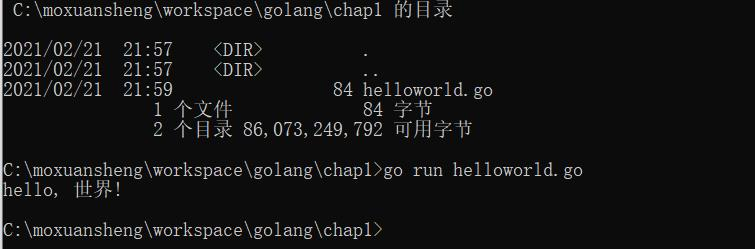

# 第1章  介绍

 [官网下载](https://golang.org/dl/) Go1.6版本，笔者在windows环境中安装，一路Next，然后在cmd中运行。


## 配置


## Hello World

一门语言的学习从“hello world”开始，非常亲切。先运行一个“hello world”了解一下基本面。

运行[hello word程序](helloworld.go)，得到结果：



程序代码结构看起来非常简单：

```go
package main

import "fmt"

func main() {
    fmt.Println("hello, 世界!");
}
```


- 包的声明、引用

- 定义main方法

- 看起来就像python+C的方式。

  看起简单，那就Next。
  