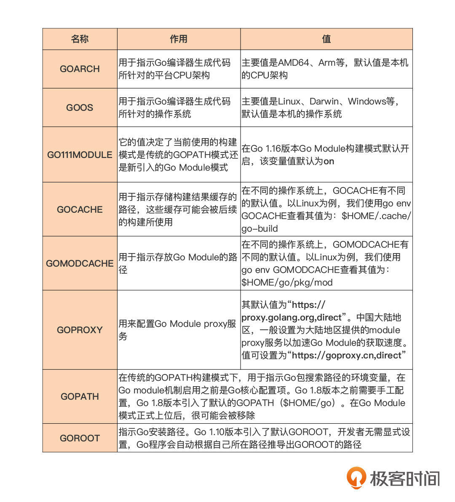

# 第1章  介绍

 [官网下载](https://golang.org/dl/) Go1.6版本，笔者在windows环境中安装，一路Next，然后在cmd中运行。


## 配置

 Go主要的环境配置如下：



其中，需要注意```GO111MODULE```名称，设置为on，采用Go module构建模式。


## Hello World

一门语言的学习从“hello world”开始，非常亲切。先运行一个“hello world”了解一下基本面。

### 代码结构

运行[hello word程序](helloworld.go)，得到结果：


程序代码结构看起来非常简单：

```go
package main

import "fmt"

func main() {
    fmt.Println("hello, 世界!");
}
```


- 包的声明、引用

- 定义main方法

- 看起来就像python+C的方式。

  看起简单，那就Next。

### 执行过程

main 包中的 main 函数是所有 Go 可执行程序的用户层执行逻辑的入口函数。但它却不一定是用户层第一个被执行的函数。

#### init函数

进行包初始化的 init 函数。

```go
func init() {
    // 包初始化逻辑
    ... ...
}
```

如果main包依赖的包中定义了init函数，或者main包自己定义了init函数，那么 Go 程序在这个包初始化的时候，就会自动调用它的 init 函数，因此这些 init 函数的执行就都会发生在 main 函数之前。但是不能显示的调用init函数。

```go
package main

import "fmt"

func init() {
	fmt.Println("start init func")
}
func main() {

	init()

}
```

编译时报错：


### init函数用途

- Go 包初始化时，init 函数的初始化次序在变量之后，可以通过init函数对这些变量进行初始化或者操作；
- 实现对包级变量的复杂初始化；
- 通过在 init 函数中注册自己的实现的模式，就有效降低了 Go 包对外的直接暴露，尤其是包级变量的暴露，从而避免了外部通过包级变量对包状态的改动。