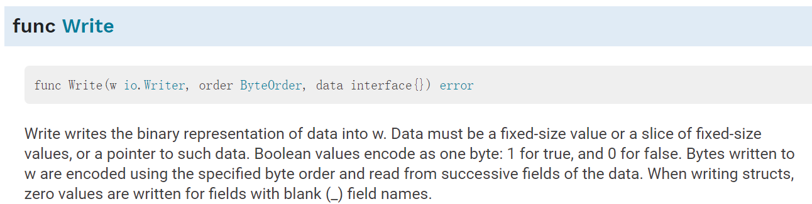

#  第13章 标准库

本章对于golang标准库中常用包的使用进行说明。

## 13.1 flag包

flag包实现了命令行参数的解析。通过：```flag.String(), Bool(), Int()``` 定义不同类型的命令行参数。

示例：

```go
import "flag"
var nFlag = flag.Int("n", 1234, "help message for flag n")
```

定义了int类型的参数，**需要注意的是返回了int类型指针**，方法定义为：

```go
func Int(name string, value int, usage string) *int
```

参数：

- name，flag名称；
- value，默认值；
- usage，使用提示。

或者通过Var方法将参数绑定到某个变量：

```go
var flagvar int
func init() {
	flag.IntVar(&flagvar, "flagname", 1234, "help message for flagname")
}
```

定义了flag之后，调用```flag.Parse()``` 解析命令行参数到定义的flag中。

[示例程序](flag_example.go)：

```go
package main

import (
    "flag"
    "fmt"
)

func main() {
    wordPtr := flag.String("word", "foo", "a string")
    numberPtr := flag.Int("numb", 10, "an int")
    var svar string
    flag.StringVar(&svar, "svar", "bar", "a string var")
    
    flag.Parse()
    
    fmt.Println("word", *wordPtr)
    fmt.Println("numb", *numberPtr)
    fmt.Println("svar", svar)
    
}
```

 

## 13.2 JSON格式编解码

JSON是对JavaScript中各种类型的值——字符串、数字、布尔值和对象——Unicode本文编码。

Go语言标准库中encoding/json提供了对json格式数据的编解码处理。

### 13.2.1 json格式读取

配置文件基于json格式，读取配置文件格式到结构体中，[示例程序：](json_example.go)

```go
package main

import (
    "fmt"
    "encoding/json"
    _ "os"
)


type MyStruct struct {
    Name string
    Age int
}

func main() {

    stud := MyStruct {
        Name: "tony",
        Age: 13}
    
    data, err := json.Marshal(stud)
    if err != nil {
        fmt.Println("json marshal failed:%s", err)
    }
    
    fmt.Println(string(data)    
    
}
```

结构体输出结果为：


### 13.2.2 json格式文件读取

文件内容如下：

```json
{
    "structlist" :[
        {
            "Name": "tony",
            "Age": 27
        },
        {
            "Name": "tom",
            "Age": 22
        }
    
    ]
}
```

定义对应的结构体：

```go
type MyStructList struct {
    StructList []MyStruct `json:"structlist"`
}

type MyStruct struct {
    Name string `json:"Name"`
    Age int `json:"Age"`
}

```

读取json文件后解码：

```go
    //读取json file
    filepath := "conf.json"
    jsonfile, err := os.Open(filepath)
    if err != nil {
        fmt.Println("open error.")
        os.Exit(1)
    }
    defer jsonfile.Close()
    
    //读取json文件
    byteBuffer, err := ioutil.ReadAll(jsonfile)
    fmt.Println(string(byteBuffer))
    
    var mylists MyStructList
    
    unerr := json.Unmarshal(byteBuffer, &mylists)
    
    if unerr != nil {
        fmt.Println(unerr)
        os.Exit(1)
    }
    //输出json信息
    listlen := len(mylists.StructList)
    fmt.Println("the json list len is:", listlen)
    for i := 0; i < listlen; i++ {
        fmt.Println("Name: ", mylists.StructList[i].Name)
        fmt.Println("Age: ", mylists.StructList[i].Age)
        fmt.Println("---")
    }
```


## 13.3 文件操作

对于文件创建、打开、关闭、写入、读取等基本操作进行描述。

### 13.3.1 文件创建和写入

golang中文件的创建可以通过```create```函数:

```go
func Create(name string) (*File, error)
```

重建或者截断，如果文件存在则截断，不存在则创建文件，创建的模式为0666.

或者通过```open```函数：

```go
func OpenFile(name string, flag int, perm FileMode) (*File, error)
```

默认flag是O_RDONLY 。如果文件不存在则创建，传入 O_CREATE flag 。

Flag列表如下：

```go
const (
    // Exactly one of O_RDONLY, O_WRONLY, or O_RDWR must be specified.
    O_RDONLY int = syscall.O_RDONLY // open the file read-only.
    O_WRONLY int = syscall.O_WRONLY // open the file write-only.
    O_RDWR   int = syscall.O_RDWR   // open the file read-write.
    // The remaining values may be or'ed in to control behavior.
    O_APPEND int = syscall.O_APPEND // append data to the file when writing.
    O_CREATE int = syscall.O_CREAT  // create a new file if none exists.
    O_EXCL   int = syscall.O_EXCL   // used with O_CREATE, file must not exist.
    O_SYNC   int = syscall.O_SYNC   // open for synchronous I/O.
    O_TRUNC  int = syscall.O_TRUNC  // truncate regular writable file when opened.
)
```

mode类型如下：

```go
const (
    // The single letters are the abbreviations
    // used by the String method's formatting.
    ModeDir        = fs.ModeDir        // d: is a directory
    ModeAppend     = fs.ModeAppend     // a: append-only
    ModeExclusive  = fs.ModeExclusive  // l: exclusive use
    ModeTemporary  = fs.ModeTemporary  // T: temporary file; Plan 9 only
    ModeSymlink    = fs.ModeSymlink    // L: symbolic link
    ModeDevice     = fs.ModeDevice     // D: device file
    ModeNamedPipe  = fs.ModeNamedPipe  // p: named pipe (FIFO)
    ModeSocket     = fs.ModeSocket     // S: Unix domain socket
    ModeSetuid     = fs.ModeSetuid     // u: setuid
    ModeSetgid     = fs.ModeSetgid     // g: setgid
    ModeCharDevice = fs.ModeCharDevice // c: Unix character device, when ModeDevice is set
    ModeSticky     = fs.ModeSticky     // t: sticky
    ModeIrregular  = fs.ModeIrregular  // ?: non-regular file; nothing else is known about this file

    // Mask for the type bits. For regular files, none will be set.
    ModeType = fs.ModeType

    ModePerm = fs.ModePerm // Unix permission bits, 0o777
)
```


[示例程序：](file_example.go)

```go
package main

import (
    "os"
    "log"
    "fmt"
)

func main() {
    filepath := "test.txt"

    newFile, err := os.Create(filepath)
    if err != nil {
        log.Fatal(err)
    }
    //write string
    newFile.Write([]byte("hello world"))
    newFile.Close()
    
    //open and read file
    bytebuffer := make([]byte, 16)   
    newFile2, err := os.Open(filepath)
    nbytes, err:= newFile2.Read(bytebuffer)
    fmt.Printf("read len:%d str is:%s", nbytes, string(bytebuffer))
    defer newFile2.Close()
}
```


 ## 13.3 二进制编码

 Go’s *encoding/*[*Binary*](https://golang.org/pkg/encoding/binary/) package

Go语言encoding/Binary数据包用于将数值编解码为二进制数据。可以通过多种方法将固定长度类型的数值进行编解码。

并提供了大端、小端处理接口：```binary.LittleEndian and binary.BigEndian```。

### 13.3.1 编解码方式

按照不同的整数类型```Uint16\Uint32```等进行编解码：

```go
    buf := make([]byte, 10)
    //ts := uint32(time.Now().Unix())
    
    binary.BigEndian.PutUint16(buf[0:], 0x0101)
    binary.BigEndian.PutUint16(buf[2:], 0x0201)
    binary.BigEndian.PutUint32(buf[4:], 0x0301)
    binary.BigEndian.PutUint16(buf[8:], 0x0401)
    
    fmt.Printf("%x\n", buf)
    
    sensorID := binary.BigEndian.Uint16(buf[0:])
    locID :=  binary.BigEndian.Uint16(buf[2:])
    tstamp :=  binary.BigEndian.Uint32(buf[4:])
    temp :=  binary.BigEndian.Uint16(buf[8:])
    
    fmt.Printf("sid: %0#x, locID %0#x ts: %0#x, temp:%d\n", sensorID, locID, tstamp, temp)
```

- ```binary.BigEndian.PutUint16``` 根据整数类型确定字节数组中的大小
- 设置BigEndian或者LittleEndian。


### 13.3.2 通过IO流编解码

上面的示例中，逐个字段对数据包进行编码和解码，对于具有多个字段的较大数据包可能容易出错。可以通过IO接口中的`io.Reader` and `io.Writer` 编解码数据。

（1）函数binary.Write(w [io](https://golang.org/pkg/io/).[Writer](https://golang.org/pkg/io/#Writer), o [ByteOrder](https://golang.org/pkg/encoding/binary/#ByteOrder), data interface{})

上面的示例中定义数据包：

```go
type packet struct {
    Sensid uint32
    Locid  uint16
    Tstamp uint32
    Temp   int16
}
```


```go
func main() {
    dataIn := packet {
        Sensid: 1, Locid: 1233, Tstamp: 123452123, Temp: 12,
    }
    
    buf := new(bytes.Buffer)
    
    err := binary.Write(buf, binary.BigEndian, dataIn)
    
    if err != nil {
        fmt.Println(err)
        return
    }
    
    //Buffer长度
    fmt.Printf("%d\n", buf.Len())
    
}
```

**需要注意的是结构体仅包含期望顺序的数字类型字段。** 数据必须是固定长度的。




如果包含了字符串类型，报错：```binary.Write: invalid type main.packet```.


###  参考文件

[go语言文件操作](https://www.devdungeon.com/content/working-files-go)

[JSON-to-Go类型定义](https://mholt.github.io/json-to-go/)

[Golang bytes.Buffer 用法精述](https://blog.csdn.net/K346K346/article/details/94456479)

[binary.Write](https://golang.org/pkg/encoding/binary/#example_Write)