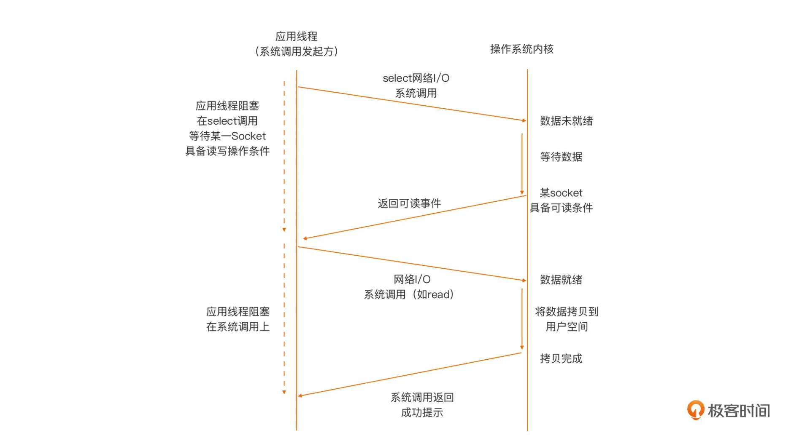

# 第14章 Go网络编程

本章对Go语言网络编程内容进行整理，读者需要对网络基础知识有一定了解。


## 14.1 网络地址

对于TCP、UDP编程主要内容进行整理。


### 14.1.1 IP地址类型

Go语言中“net”包定义了多种类型，IP地址通过“byte slice”定义：

```go
type IP []byte
```

可以通过``ParseIP``方法解析[IP地址](ipaddr.go)：

```go
package main

import(
    "net"
    "os"
    "fmt"
)

func main() {
    if len(os.Args) != 2 {
        fmt.Fprintf(os.Stderr, "usage: %s ip-addr\n", os.Args[0])
        os.Exit(1)
    }
    
    name := os.Args[1]
    
    //解析IP地址
    addr := net.ParseIP(name)
    if addr == nil {
        fmt.Println("invalid address")
    }
    else {
        fmt.Println("the addr is:", addr.String())
    }
    
    os.Exit(0)
}
```

### 14.1.2 IPAddr类型

部分函数返回了IPAddr指针，是一个简单的结构体包含了一个IP。

```go
type IPAddr {
    ip IP
}
```

常用于DNS查询获得IP地址：

```go
func	ResolveIPAddr(net,	addr	string)	(*IPAddr,	os.Error)
```

[解析IP地址](resolveip.go)：

```go
package main

import(
    "net"
    "os"
    "fmt"
)

func main() {
    if len(os.Args) != 2 {
        fmt.Fprintf(os.Stderr, "usage: %s ip-addr\n", os.Args[0])
        os.Exit(1)
    }
    
    name := os.Args[1]
    
    //解析IP地址
    addr, err := net.ResolveIPAddr(name)
    if err != nil {
        fmt.Println("Resolved IPAddr error", err.Error())
        os.Exit(1)
    }
    fmt.Println("Resolved IPAddr is", addr.String()) 
    
    os.Exit(0)
}
    
```


### 14.1.3 主机查询

``ResolveIPAddr`` DNS查询返回一个IP地址。如果主机有多个网络接口配置多个IP地址，有不同的主机名称，通过如下函数查询：

```go
func	LookupHost(name	string)	(addrs	[]string,	err	os.Error)
```

规范主机查询：

```go
func	LookupCNAME(name	string)	(cname	string,	err	os.Error)
```

[查询多个IP地址](lookuphost.go):

```go
package main

import(
    "net"
    "os"
    "fmt"
)

func main() {
    if len(os.Args) != 2 {
        fmt.Fprintf(os.Stderr, "usage: %s ip-addr\n", os.Args[0])
        os.Exit(1)
    }
    
    name := os.Args[1]
    
    //解析查询IP地址
    addrs, err := net.LookupHost(name)
    if err != nil {
        fmt.Println("Resolved IPAddr error", err.Error())
        os.Exit(2)
    }
    
    for _, s := range addrs {
        fmt.Println(s)
    }
    
    os.Exit(0)
}
    
```

**``LookUpHost`` 返回的是多个字符串，而不是``IPAddress``类型。**


## 14.2 网络服务

主机运行网络服务，通常等待请求并进行回复。


### 14.2.1 端口

网络服务通常在特定端口提供服务，*nix环境中常用端口存放在：``/etc/services``。通过``LookupPort``函数查询：

```go
func	LookupPort(network,	service	string)	(port	int,	err	os.Error)
```


``network`` 参数为类型类型：tcp、udp。``service``为服务类型。[端口查询类型](lookupport.go):

```go
package main

import(
    "net"
    "os"
    "fmt"
)

func main() {
    if len(os.Args) != 3 {
        fmt.Fprintf(os.Stderr, "usage: %s network-type serivce\n", os.Args[0])
        os.Exit(1)
    }
    
    netType := os.Args[1]
    service := os.Args[2]
    
    //查询端口服务
    port, err := net.LookupPort(netType, service)
    if err != nil {
        fmt.Println("Error:", err.Error())
        os.Exit(2)
    }
    fmt.Println("Service port:", port) 
    
    os.Exit(0)
}
    
```


### 14.2.2 TCPAddr地址

类型``TCPAddr``包含了IP地址和端口的结构体：

```go
type	TCPAddr	struct	{ 
    IP		IP
	Port	int 
}
```

通过方法``ResolveTCPAddr``创建TCPAddr：

```go
func	ResolveTCPAddr(net,	addr	string)	(*TCPAddr,	os.Error)
```

``net``是tcp、udp等，addr是主机名称或者IP以及通过“:"连接的端口号，比如：www.google.com:80、127.0.0.1:223。


## 14.3 TCP Sockets

服务端、客户端之间通信：

- 服务端：绑定端口进行监听，收到消息处理之后回复消息。

主要通过``net.TCPConn``类型完成客户端-服务端之间的双工通信，主要有两个方法：

```go
func	(c	*TCPConn)	Write(b	[]byte)	(n	int,	err	os.Error)
func	(c	*TCPConn)	Read(b	[]byte)	(n	int,	err	os.Error)
```


### 14.3.1 TCP客户端

客户端发起连接，成功后返回TCPConn进行通信。TCP连接通过``DialTCP``函数：

```go
func	DialTCP(net	string,	laddr,	raddr	*TCPAddr)	(c	*TCPConn,	err	os.Error)
```

其中的``laddr``是本地地址，通常设置为nil（**如果是本机多网络地址？**）,raddr是提供服务的远程地址，``net``字符串是网络类型：“tcp"、"tcp4"、"tcp6"。

[访问web服务](getheadinfo.go):

```go
package main

import(
    "net"
    "os"
    "fmt"
    "io/ioutil"
)

func main() {
    if len(os.Args) != 2 {
        fmt.Fprintf(os.Stderr, "usage: %s host:port\n", os.Args[0])
        os.Exit(1)
    }
    
    service := os.Args[1]
    
    //解析TCP地址及端口
    tcpAddr, err := net.ResolveTCPAddr("tcp4", service)
    checkError(err)
    
    //发起TCP连接
    conn, err := net.DialTCP("tcp", nil, tcpAddr)
    checkError(err)
    
    //向服务端发送head命令
    _, err := conn.Write([]byte("HEAD / HTTP/1.0\r\n\r\n"))
    checkError(err)
    
    result, err := conn.ReadAll(conn)
    checkError(err)
    fmt.Println(string(result))
    
    os.Exit(0)
    
}

func checkError(err error) {
    if err != nil {
        fmt.Println(os.Stderr, "Fatal error: %s", err.Error())
        os.Exit(1)
    }

```

需要注意一些异常的处理：

- 地址语法错误
- 连接远程服务失败
- 即时连接成功，读写的时候也可能以为网络中断、超时等出现异常。

TODO，读写比较。


### 14.3.2 DayTime服务示例

daytime服务是在RFC 867中定义的网络服务，端口为：13，可以通过TCP或者UDP访问。

基本流程：

- 服务端注册端口后监听，然后阻塞在``accept``操作，等待客户端接入。
- 当客户端连接之后，accept调用返回连接对象。

主要函数调用如下：

```go
func	ListenTCP(net	string,	laddr	*TCPAddr)	(l	*TCPListener,	err	os.Error) func	(l	*TCPListener)	Accept()	(c	Conn,	err	os.Error)
```


[示例程序](daytimeserver.go):

```go
package main

import(
    "net"
    "os"
    "fmt"
    "time"
)

func main() {

    service := ":1200"

    //解析TCP地址及端口
    tcpAddr, err := net.ResolveTCPAddr("tcp4", service)
    checkError(err)
    
    //监听端口
    listener, err := net.ListenTCP("tcp", tcpAddr)
    checkError(err)
    
    for {
        conn, err := listener.Accept()
        
        if err != nil {
            conntinue
        }
        
        daytime := time.Now().String()
        conn.Write([]byte(daytime))
        conn.Close()
    }
    
}

func checkError(err error) {
    if err != nil {
        fmt.Println(os.Stderr, "Fatal error: %s", err.Error())
        os.Exit(1)
    }

```

  

这个服务每次只能接收一个客户端。可以通过“多线程”的方式服务服务多个客户端，[程序示例](thdechoserver.go):

```go
package main

import(
    "net"
    "os"
    "fmt"
)

func main() {

    service := ":1200"

    //解析TCP地址及端口
    tcpAddr, err := net.ResolveTCPAddr("tcp4", service)
    checkError(err)
    
    //监听端口
    listener, err := net.ListenTCP("tcp", tcpAddr)
    checkError(err)
    
    for {
        conn, err := listener.Accept()
        
        if err != nil {
            conntinue
        }
        
        go handleClient(conn)
    }
    
}

func handleClient(conn net.Conn) {
    defer conn.Close()
    
    var buf [512]byte
    for {
        n, err := conn.Read(buf[0:])
        if err != nil {
            return
        }
        
        //write data，收到了
        _, err2 := conn.Write(buf[0:n])
        if err2 != nil {
            return 
        }
    }
}

func checkError(err error) {
    if err != nil {
        fmt.Println(os.Stderr, "Fatal error: %s", err.Error())
        os.Exit(1)
    }


```

通过关键字``go``采用go-coroutine方式执行，完成“多线程”服务。


### 14.3.3 超时设置

socket读写时可以设置超时：

```go
func	(c	*TCPConn)	SetTimeout(nsec	int64)	os.Error
```


### 14.3.4 保活设置

如果希望在没有数据时仍然能够保持连接，可以进行保活设置：

```go
func	(c	*TCPConn)	SetKeepAlive(keepalive	bool)	os.Error
```


## 14.4 UDP

主要函数有：

```go
func	ResolveUDPAddr(net,	addr	string)	(*UDPAddr,	os.Error)
func	DialUDP(net	string,	laddr,	raddr	*UDPAddr)	(c	*UDPConn,	err	os.Error)
func	ListenUDP(net	string,	laddr	*UDPAddr)	(c	*UDPConn,	err	os.Error)
func	(c	*UDPConn)	ReadFromUDP(b	[]byte)	(n	int,	addr	*UDPAddr,	err	os.Error
func	(c	*UDPConn)	WriteToUDP(b	[]byte,	addr	*UDPAddr)	(n	int,	err	os.Error)
```


UDP方式的datetimeserver[程序为](udpdaytimeserver.go)：

```go
package main

import(
    "net"
    "os"
    "fmt"
    "time"
)

func main() {

    service := ":1200"

    //解析TCP地址及端口
    tcpAddr, err := net.ResolveUDPAddr("udp4", service)
    checkError(err)
    
    //监听端口
    listener, err := net.ListenUDP("udp", tcpAddr)
    checkError(err)
    
    for {
        handleClient(conn)
    }
    
}

func handleClient(conn *net.UDPConn) {
    var buf [512]byte
    _, addr, err := conn.ReadFromUDP(buf[0:])
    
    if err != nil {
        return
    }
    
    daytime := time.Now().String()
    
    conn.WriteToUDP([]byte(daytime), addr)
}

func checkError(err error) {
    if err != nil {
        fmt.Println(os.Stderr, "Fatal error: %s", err.Error())
        os.Exit(1)
    }

```


## 14.5 Conn、PacketConn以及Listener类型

单一的函数发送TCP或者UDP连接：

```go
func	Dial(net,	laddr,	raddr	string)	(c	Conn,	err	os.Error)
```

``net`` 字符串可以为“tcp"、"tcp4"、"udp"、"udp4"。

单一的socket监听函数：

```go
func	Listen(net,	laddr	string)	(l	Listener,	err	os.Error)
```


## 14.6 RawSocket和IPConn类型

Go语言运行创建原始套接字：


## 14.7 数据序列化

客户端-服务端之间通常使用结构化数据：

- 记录、结构体
- 数组，固定或者变长
- 字符串，固定或者变长
- 表格
- 非线性结构：
  - 二叉树
  - 循环列表
  - 对象指针。

需要序列与反序列化。

如果需要发送如下包含两列变长字符串的变长表格：

| fred   | programmer |
| ------ | ---------- |
| liping | analyst  |
| sureerat | manager |

可以基于特定规则方式进行发送：

```
3
4 fred
10 programmer
6 liping
7 analyst
8 sureerat
7 manager
```

先发送长度，再发送一条记录，记录中的字段标注长度。

或者通过尾部的'\0'标识一个字段的结束：

```
3
fred\0
programmer\0
liping\0
analyst\0
sureerat\0
manager\0
```

### 14.7.1 抽象语法标记

Go语言提供了ASN.1库【】，通过如下方法marshals和unmarshals数据：

```go
func	Marshal(val	interface{})	([]byte,	os.Error)
func	Unmarshal(val	interface{},	b	[]byte)	(rest	[]byte,	err	os.Error)
```

示例程序如下：

```go
package main

import(
    "encoding/asn1"
    "os"
    "fmt"
)

func main() {

    mdata, err := ans1.Marshal(13)
    
    var n int
    
    _, err1 := asn1.UnMarshal(mdata, &n)

    checkError(err1)
    
    fmt.Println("After marshal/unmarshal: ", n)
}


func checkError(err error) {
    if err != nil {
        fmt.Println(os.Stderr, "Fatal error: %s", err.Error())
        os.Exit(1)
    }

```

### 14.7.8 JSON

JSON是JavaScript	Object	Notation。JSON可以序列化对象、数组和基本值。基本值包括：字符串、数字、布尔值和null值。

```go
package main

import(
    "os"
    "fmt"
    "encoding/json"
)

type Person struct {
    Name Name
    Email [] Email
}

type Name struct {
    Family string
    Personal string
}

type Email struct {
    Kind string
    Address string
}


func main() {
    //结构体初始化
    person := Person {
            Name: Name{Family: "newmarch", Personal: "Jan"},
            Email: []Email{Email{Kind: "home", Address: "Jan@newmarch.name"},
                        Email{Kind: "work", Address: "j.newmarch@boxhill.edu.au"}
                        }
                    }
    saveJSON("person.json", person)
    
}


func saveJSON(fileName string, key interface{}) {
    outFile, err := os.Create(fileName)
    checkError(err)
    encoder := json.NewEncoder(outFile)
    err := encoder.Encode(key)
    checkError(err)
    outFile.Close()
}

func checkError(err error) {
    if err != nil {
        fmt.Println(os.Stderr, "Fatal error: %s", err.Error())
        os.Exit(1)
    }

```


反序列化过程：

```go
package main

import(
    "os"
    "fmt"
    "encoding/json"
)

type Person struct {
    Name Name
    Email [] Email
}

type Name struct {
    Family string
    Personal string
}

type Email struct {
    Kind string
    Address string
}

//绑定到Person对象
func (p Person) String() String {
    s := p.Name.Personal + " " + p.Name.Family
    for _, v := range p.Email {
        s += "\n" + v.Kind + ": " + v.Address
    }
    
    return s
}


func main() {
    var person Person
    loadJSON("person.json", &person)
    
    fmt.Println("Person", person.String())
    
}

func loadJSON(fileName string, key interface{}) {

    inFile, err := os.Open(fileName)
    checkError(err)
    decoder := json.NewDecoder(inFile)
    checkError(err)
    inFile.Close()
    
}

func checkError(err error) {
    if err != nil {
        fmt.Println(os.Stderr, "Fatal error: %s", err.Error())
        os.Exit(1)
    }

```


## 14.8 应用层协议

主要内容：

- 版本控制
- 消息格式
- 数据格式


### 14.8.1 UTF8编码

Go语言中字符串使用UTF-8编码。每个字符是rune类型，该类型是Int32的别名，一个Unicode字符串可以是1、2或者4个字节。

```go
str	:=	"百度⼀下，你就知道"
println("String	length",	len([]rune(str))) 
println("Byte	length",	len(str))
```

## 14.9 Epoll方式

通常Go语言的TCP连接的处理可以每一个连接启动一个goroutine去处理，因为goroutine相对线程消耗资源更少。但如果需要处理上百万个连接时，需要启动上百万个goroutine，对资源消耗仍然非常大。

### 14.9.1 goroutine-per-connection模式

对于每个连接启动给一个goroutine进行处理，基于C/S模式进行评估。

[服务端代码为](thdechoserver.go)：

```go
package main

import (
    "net"
    "fmt"
    "io"
    "io/ioutil"
)

func main() {
    var connections []net.Conn
    sock, err := net.Listen("tcp", "12345")
    if err != nil {
        return
    }
    
    defer func() {
        for _, conn := range connections {
            conn.Close()
        }
    }()
    
    for {
        conn, e := sock.Accept()
        if e != nil {
            if ne, ok := e.(net.Error); ok && ne.Temporary() {

                continue
            }
        }
        
        go handleConn(conn)
        
        connections = append(connections, conn)
    }
    
}

func handleConn(conn net.Conn) {
    io.Copy(ioutil.Discard, conn)
    fmt.Println("handleConn")
}
```

[客户端代码为](goroutine-per-conn-cli.go)：

```go
package main

import (
    "net"
    "fmt"
    "flag"
    "time"
)

var (
    ip = flag.String("ip", "127.0.0.1", "Server IP")
    connections = flag.Int("conn", 1, "number of tcp connections")
)

func main() {
    //分析参数
    flag.Parse()
    
    addr := *ip + ":12345"
    fmt.Println("连接到:%s", addr)
    var conns []net.Conn
    
    for i := 0; i < *connections; i++   {
        c, err := net.DialTimeout("tcp", addr, 10 *time.Second)
        if err != nil {
            fmt.Println("failed to connect", i, err)
        }
        
        conns = append(conns, c)
        
        time.Sleep(time.Millisecond)
    }
    
    defer func() {
        for _, c := range conns {
            c.Close()
        }
    }()
    
    fmt.Println("完成初始化 %d 连接", len(conns))
    
    tts := time.Second
    
    if *connections > 100 {
        tts = time.Millisecond * 5
    }
    
    for  {
        for i := 0; i < len(conns); i++ {
            time.Sleep(tts)
            conn := conns[i]
            conn.Write([]byte("hello world\r\n"))
        }
    }
    
}        
        
```


## 14.10 如何优雅地关闭TCP Server


### 14.10.1 TCP服务端框架

通过TCP服务端监听端口等待客户端连接，然后通过go创建goroutine与客户端进行实际的通信。伪代码框架为：

```go
listener := net.Listen("tcp", ... address ...)
for {
  conn := listener.Accept()
  go handler(conn)
}
```

### 14.10.2 等待客户端连接关闭

可以明确关闭监听（停止接受新连接），等待客户端结束连接，[参照代码](shutdown_tcp.go):

```go
package shutdown1

import (
	"io"
	"log"
	"net"
	"sync"
)

type Server struct {
	listener net.Listener
	quit     chan interface{}
	wg       sync.WaitGroup
}

func NewServer(addr string) *Server {
	s := &Server{quit: make(chan interface{})}

	l, err := net.Listen("tcp", addr)

	if err != nil {
		log.Fatal(err)
	}

	s.listener = l
	s.wg.Add(1)

	go s.serve()

	return s

}

func (s *Server) Stop() {
	close(s.quit)
	s.listener.Close()
	s.wg.Wait()
}

func (s *Server) serve() {
	defer s.wg.Done()
	for {
		conn, err := s.listener.Accept()
		if err != nil {
			select {
			case <-s.quit:
				return
			default:
				log.Println("accept error:", err)
			}
		} else {
			s.wg.Add(1)
			go func() {
				s.handlerConnection(conn)
				s.wg.Done()
			}()
		}

	}
}

func (s *Server) handlerConnection(conn net.Conn) {
	defer conn.Close()
	buf := make([]byte, 2048)
	for {
		n, err := conn.Read(buf)
		if err != nil && err != io.EOF {
			log.Println()
		}

		if n == 0 {
			return
		}

		log.Printf("recv from %v: %s", conn.RemoteAddr(), string(buf[:n]))
	}
}

func init() {
	log.SetFlags(log.Ltime | log.Lmicroseconds)
}

```

- Server通过listener监听新的连接。除了```net.Listener```，Server结构体含包含了用于通知退出的管道和等待服务器所有的goroutine完成的wait group。

- 当Accept出现异常时，select检查s.quit管道是否有事件。如果发生错误，说明错误是我们关闭监听引起的，serve返回；
- 关闭 s.quit 通道，然后关闭侦听器。这将导致服务中的 Accept 调用返回错误。由于此时 s.quit 已经关闭，所以 serve 将返回；
- s.wg.Wait()等待所有的客户端关闭。

## 14.11 TCP socket模型

tcp socket编程模型也即网络 I/O 模型，定义了应用线程与操作系统内核之间的交互行为模式。通常有阻塞和非阻塞两种模式。

如果内核一直等到全部数据就绪才返回，这种行为模式就称为阻塞。如果内核查看数据就绪状态后，即便没有就绪也立即返回错误（给发起系统调用的应用线程），那么这种行为模式则称为非阻塞。

### 14.11.1 模式

在阻塞 I/O 模型下，当用户空间应用线程，向操作系统内核发起 I/O 请求后（一般为操作系统提供的 I/O 系列系统调用），内核会尝试执行这个 I/O 操作，并等所有数据就绪后，将数据从内核空间拷贝到用户空间，最后系统调用从内核空间返回。而在这个期间内，用户空间应用线程将阻塞在这个 I/O 系统调用上，无法进行后续处理，只能等待。


在非阻塞模型下，当用户空间线程向操作系统内核发起 I/O 请求后，内核会执行这个 I/O 操作，如果这个时候数据尚未就绪，就会立即将“未就绪”的状态以错误码形式（比如：EAGAIN/EWOULDBLOCK），应用程序根据调用状态的返回来决定下一步该怎么做。通常采用轮询的方式发起IO请求，直到读到所需的数据为止。


为了避免非阻塞 I/O 模型轮询对计算资源的浪费，同时也考虑到阻塞 I/O 模型的低效，采用了内核提供的多路复用函数 select/poll等基础上的IO多路复用模型。



相比于阻塞模型一个线程只能处理一个 Socket 的低效，I/O 多路复用模型中，一个应用线程可以同时处理多个 Socket。同时，I/O 多路复用模型由内核实现可读 / 可写事件的通知，避免了非阻塞模型中轮询，带来的 CPU 计算资源浪费的问题。


### 14.11.2 Go语言 socket编程模型

Go 选择了为开发人员提供阻塞 I/O 模型，对于 Go 程序的用户层（相对于 Go 运行时层）来说，它眼中看到的 goroutine 采用了“阻塞 I/O 模型”进行网络 I/O 操作，Socket 都是“阻塞”的。这样的“假象”，是通过 Go 运行时中的 netpoller I/O 多路复用机制，“模拟”出来的，对应的、真实的底层操作系统 Socket，实际上是非阻塞的。


### 14.11.3 socket读操作

**（1）socket中无数据的场景**

如果没有收到数据，会阻塞在Socket 的读操作上，执行该这个操作的 Goroutine 也会被挂起。Go 运行时会监视这个 Socket，直到它有数据读事件，才会重新调度这个 Socket 对应的 Goroutine 完成读操作。

**（2）Socket 中有部分数据**

如果 Socket 中有部分数据就绪，且数据数量小于一次读操作期望读出的数据长度，那么读操作将会成功读出这部分数据，并返回，而不是等待期望长度数据全部读取后，再返回。

**（3）Socket 中有足够数据**

如果连接上有数据，且数据长度大于等于一次Read操作期望读出的数据长度，那么Read将会成功读出这部分数据，并返回。这个情景是最符合我们对Read的期待的了。

**（4）设置读操作超时**

我们可以通过 net.Conn 提供的 SetReadDeadline 方法，设置读操作的超时时间，当超时后仍然没有数据可读的情况下，Read 操作会解除阻塞并返回超时错误，这就给 Read 方法的调用者提供了进行其他业务处理逻辑的机会。

### 14.11.4 socket写操作

**（1）写阻塞**

CP 协议通信两方的操作系统内核，都会为这个连接保留数据缓冲区，调用 Write 向 Socket 写入数据，实际上是将数据写入到操作系统协议栈的数据缓冲区中。如果缓冲区写满了，再调用 Write 方法就会出现阻塞的情况。

**（2）写入部分数据**

写入部分数据后断开，返回broken pipe错误。

**（3）写入超时**

在 Write 方法写入超时时，依旧存在数据部分写入（仅写入 24108 个字节）的情况。另外，和 SetReadDeadline 一样，只要我们通过 SetWriteDeadline 设置了写超时，那无论后续 Write 方法是否成功，如果不重新设置写超时或取消写超时，后续对 Socket 的写操作都将以超时失败告终。

## 参考文献

https://colobu.com/2019/02/23/1m-go-tcp-connection/


https://eli.thegreenplace.net/2020/graceful-shutdown-of-a-tcp-server-in-go/

