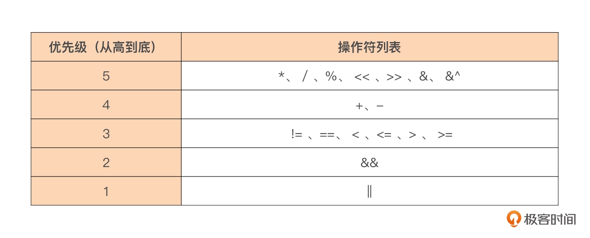

# 控制流程

## if控制语句

if语句的布尔表达式不需要整体的括号，如果判断的条件比较多，可以用多个逻辑操作符连接起多个条件判断表达式。逻辑操作符共有三种：逻辑与&&、逻辑或||、逻辑非！。优先级如下：

### 支持声明 if 语句的自用变量

可以在if后的布尔表达式前，进行一些变量声明，只在if语句的代码块范围内使用。

## for循环

Go语言的for循环支持声明多循环变量。