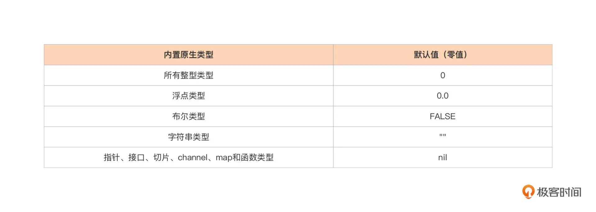
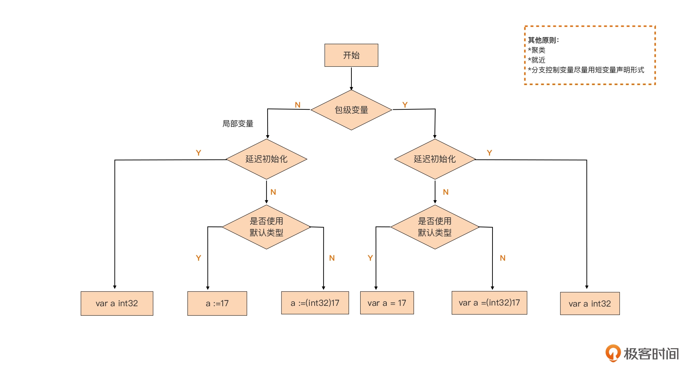
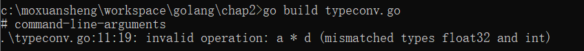

# 第二章、语法

## 2.1 命名

函数名、变量名、常量名等所有的命名，都遵循一个简单的命名规则：一个名字必须以一个字母（Unicode字母）或下划线开头，后面可以跟任意数量的字母、数字或下划线。大写字母和小写字母是不同的：heapSort和Heapsort是两个不同的名字，**区分大小写。** 

一个由Unicode大写字母开头的标识符称为导出标识符，其他标识符我非导出标识符。导出可以理解为public、非导出可以理解为private。**是不是有点面向对象访问控制的感觉，^__^**

以下是合法的标识符：

```go
大学
```

关键字有：

```go
break      default       func     interface   select
case       defer         go       map         struct
chan       else          goto     package     switch
const      fallthrough   if       range       type
continue   for           import   return      var
```

内部定义常量、类型或者函数：

```go
内建常量: true false iota nil

内建类型: int int8 int16 int32 int64
          uint uint8 uint16 uint32 uint64 uintptr
          float32 float64 complex128 complex64
          bool byte rune string error

内建函数: make len cap new append copy close delete
          complex real imag
          panic recover
```

在习惯上，Go语言程序员推荐使用 **驼峰式** 命名，当名字由几个单词组成时优先使用大小写分隔，而不是优先用下划线分隔。而像ASCII和HTML这样的缩略词则避免使用大小写混合的写法。

## 2.2 声明

声明语句定义了程序的各种实体对象以及部分或全部的属性。Go语言主要有四种类型的声明语句：var、const、type和func，分别对应变量、常量、类型和函数实体对象的声明。

go源文件中，以包的声明语句开始，说明该源文件是属于哪个包。包声明语句之后是import语句导入依赖的其它包。

比如[测试程序](boiling.go)，代码如下：

```Go
// Boiling prints the boiling point of water.
package main

import "fmt"

const boilingF = 212.0

func main() {
    var f = boilingF
    var c = (f - 32) * 5 / 9
    fmt.Printf("boiling point = %g°F or %g°C\n", f, c)
    // Output:
    // boiling point = 212°F or 100°C
}
```

其中常量boilingF是在包一级范围声明语句声明的，然后f和c两个变量是在main函数内部声明的声明语句声明的。
在包一级声明语句声明的名字可在整个包对应的每个源文件中访问，而不是仅仅在其声明语句所在的源文件中访问。相比之下，局部声明的名字就只能在函数内部很小的范围被访问。
一个函数的声明由一个函数名字、参数列表（由函数的调用者提供参数变量的具体值）、一个可选的返回值列表和包含函数定义的函数体组成。


### 2.2.1 常量声明

用const关键字声明有名常量：

```go
const d = 1
//声明一组常量
const (
	No = !Y
	Yes = true
	
)
```

常量声明自动补全：

```go
const (
    X float32 = 3.14
    Y
    Z
    A = "test"
    B
)

func main() {
    fmt.Println(Z)
    fmt.Println(B)
}
```

​	Go编译器将通过照抄前面最紧挨的一个完整的常量描述来自动补全不完整的常量描述。	


## 2.3 变量

var声明语句可以创建一个特定类型的变量，然后给变量附加一个名字，并且设置变量的初始值。

```go
var 变量名字 类型 = 表达式
```

**其中“*类型*”或“*= 表达式*”两个部分可以省略其中的一个。如果省略的是类型信息，那么将根据初始化表达式来推导变量的类型信息。如果初始化表达式被省略，那么将用零值初始化该变量。**

 数值类型变量对应的零值是0，布尔类型变量对应的零值是false，字符串类型对应的零值是空字符串，接口或引	用类型（包括slice、指针、map、chan和函数）变量对应的零值是nil，另外，像数组、结构体这样复合类型变量的零值就是它们组成元素都为零值时的结果。



**默认做了零值初始化。**

### 2.3.1 简短变量声明

在函数内部，有一种称为简短变量声明语句的形式可用于声明和初始化局部变量。它以“名字 := 表达式”形式声明变量，变量的类型根据表达式来自动推导。

### 2.3.2 省略类型信息的声明
在通用的变量声明的基础上，Go 编译器允许我们省略变量声明中的类型信息：

```go
var 变量名 = 表达式
```

Go 编译器会根据右侧变量初值自动推导出变量的类型，并给这个变量赋予初值所对应的默认类型。

### 2.3.3 包级变量的声明形式

包级变量只能使用带有var关键字的变量声明形式，不能使用断变量声明形式。

（1）声明并同时显式初始化

（2）声明但延迟初始化

```go
var a int32
var f float64
```




### 2.3.4 指针

一个指针的值是另一个变量的地址。一个指针对应变量在内存中的存储位置。并不是每一个值都会有一个内存地址，但是对于每一个变量必然有对应的内存地址。通过指针，我们可以直接读或更新对应变量的值，而不需要知道该变量的名字（如果变量有名字的话）。

如果用“var x int”声明语句声明一个x变量，那么&x表达式（取x变量的内存地址）将产生一个指向该整数变量的指针，指针对应的数据类型是`*int`。

另外，需要注意的是：**在Go语言中，返回函数中局部变量的地址也是安全的。例如下面的代码，调用f函数时创建局部变量v，在局部变量地址被返回之后依然有效，因为指针p依然引用这个变量。** 

[参见内容](https://golang.org/doc/effective_go):

```html
Note that, unlike in C, it's perfectly OK to return the address of a local variable; the storage associated with the variable survives after the function returns.
```


```go

var p = f()

func f() *int {
    v := 1
    return &v
}
```


### 2.3.5 new函数

另一个创建变量的方法是调用内建的new函数。表达式new(T)将创建一个T类型的匿名变量，初始化为T类型的零值，然后返回变量地址，返回的指针类型为`*T`。

[示例程序](newvar.go):

```
package main

import "fmt"


func main(){
    p := new(int)
    *p = 2
    fmt.Println(*p)
}
```


### 2.3.6 避免变量遮蔽

代码编写过程中会存在变量遮蔽的情况：

- 遮蔽预定义标识符
- 遮蔽包代码块中的变量
- 遮蔽外层显式代码块中的变量

可以通过检测变量遮蔽的问题：

（1）安装检查插件

```go

$go install golang.org/x/tools/go/analysis/passes/shadow/cmd/shadow@latest
go: downloading golang.org/x/tools v0.1.5
go: downloading golang.org/x/mod v0.4.2
```

（2）插件检查

```go
$go vet -vettool=$(which shadow) -strict complex.go 
./complex.go:13:12: declaration of "err" shadows declaration at line 11
```


## 2.4 赋值

最简单的赋值语句是将要被赋值的变量放在=的左边，新值的表达式放在=的右边。

### 2.4.1 元组赋值

元组赋值是另一种形式的赋值语句，它允许同时更新多个变量的值。在赋值之前，赋值语句右边的所有表达式将会先进行求值，然后再统一更新左边对应变量的值。

## 2.5 类型

Go语言中类型转换分为强制转换和类型断言。

在C/C++语言中，编译器可以隐式的把类型向上提升。但是Go语言中会报错，需要进行类型转换。

### 2.5.1 强制类型转换

通过type(a)这种形式强制类型转换，[比如程序](typeconv.go):

```go
package main

import (
    "fmt"
)

func main() {
    var a float32 = 10
    var d int = 3
    
    fmt.Println(a * d)
}
```

​	编译报错，类型不匹配：



进行强制转换:

```go
 fmt.Println(a * float32(d))
```

### 2.5.2 类型断言

```go
package main

import "fmt"

func main() {
    var a interface{} =10
    switch a.(type){
    case int:
            fmt.Println("int")
    case float32:
            fmt.Println("string")
    }
}
```

