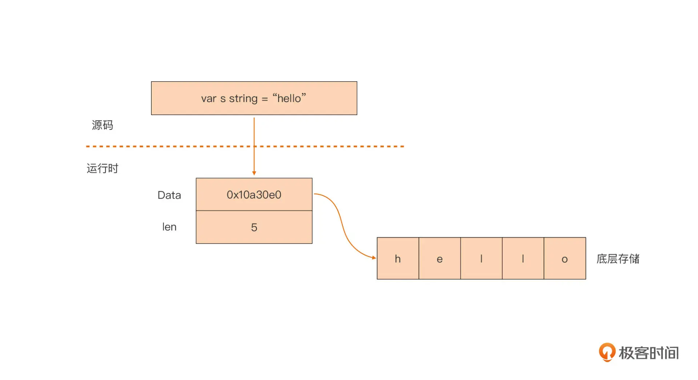
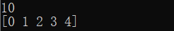
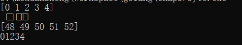

# 第三章、基础数据类型

Go语言支持如下的基本内置类型：

- 一种内置布尔类型：`bool`。
- 11种内置整数类型：`int8`、`uint8`、`int16`、`uint16`、`int32`、`uint32`、`int64`、`uint64`、`int`、`uint`和`uintptr`。
- 两种内置浮点数类型：`float32`和`float64`。
- 两种内置复数类型：`complex64`和`complex128`。
- 一种内置字符串类型：`string`。

Go中有两种内置类型别名（type alias）：

- byte是uint8的内置别名；
- rune是int32的内置别名。


## 3. 1 零值

每种类型都有一个零值，一个类型的零值可以看做是该类型的默认值。

- 一个布尔类型的零值表示真假中的假；
- 数值类型的零值都是零（但是不同类型的零在内存中占用的空间可能不同）；
- 一个字符串类型的零值是一个空字符串。


## 3.1 整数

Go语言的数值类型包括几种不同大小的整数、浮点数和复数。

Go语言同时提供了有符号和无符号类型的整数运算。这里有int8、int16、int32和int64四种截然不同大小的有符号整数类型，分别对应8、16、32、64bit大小的有符号整数，与此对应的是uint8、uint16、uint32和uint64四种无符号整数类型。

uintptr、int以及uint类型的值的尺寸依赖于具体编译器实现。 通常地，在64位的架构上，int和uint类型的值是64位的；在32位的架构上，它们是32位的。 编译器必须保证uintptr类型的值的尺寸能够存下任意一个内存地址。

整数类型值有四种字面量形式：十进制形式（decimal）、八进制形式（octal）、十六进制形式（hex）和二进制形式（binary）。

```go
//二进制
0b1111
0B1111 
//八进制
017
0o17
0O17
```


## 3.2 浮点数

Go语言提供了两种精度的浮点数，float32和float64

用Printf函数的%g参数打印浮点数，将采用更紧凑的表示形式打印，并提供足够的精度，但是对应表格的数据，使用%e（带指数）或%f的形式打印可能更合适。所有的这三个打印形式都可以指定打印的宽度和控制打印精度。

** 通过m.n%f 控制打印精度。

math包中除了提供大量常用的数学函数外，还提供了IEEE754浮点数标准中定义的特殊值的创建和测试：正无穷大和负无穷大，分别用于表示太大溢出的数字和除零的结果；还有NaN非数，一般用于表示无效的除法操作结果0/0或Sqrt(-1)。

浮点数类型值的字面量形式：可能包含一个十进制整数部分、一个小数点、一个十进制小数部分和一个以10为底数的整数指数部分。 整数指数部分由字母e或者E带一个十进制的整数字面量组成（xEn表示x乘以10n的意思，而xE-n表示x除以10n的意思）。

```go
1.23
0.123
.23
1.
// 一个e或者E随后的数值是指数值（底数为10）。
1.23e2=123.0
1e-1=0.1
```


## 3.3 类型别名

通过type关键字可以定义自己的类型以及类型别名：

```go
type myint int //myint和int是两个不同的类型
type u8 = uint8 //u8和uint8认为是同一个类型
```

Type MyInt int，MyInt就是int类型的名称，然后可以使用MyInt来操作int类型的数据。

```go
package main

import (
    "fmt"
)

type MyInt int

func main() {
    var a ,b c MyInt = 1, 2, 3
    c := a + b
    fmt.Println("the sum is:%d.", c)
}
```


## 3.4 字符串

一个字符串是一个不可改变的字节序列。字符串可以包含任意的数据，包括byte值0，但是通常是用来包含人类可读的文本。文本字符串通常被解释为采用UTF8编码的Unicode码点（rune）序列。

内置的len函数可以返回一个字符串中的字节数目（不是rune字符数目），索引操作s[i]返回第i个字节的字节值，i必须满足0 ≤ i< len(s)条件约束。

```GO
package main

import (
    "fmt"
)

func main() {
    s1 := "hello world"
    fmt.Println("the str len is:", len(s1))
}
```

非原生的字符串存在很多问题：

```go

#define GO_SLOGAN "less is more"
const char * s1 = "hello, gopher"
char s2[] = "I love go"
```

- 编译器不会对它进行类型校验，导致类型安全性差；
- 字符串操作时要时刻考虑结尾的’\0’，防止缓冲区溢出；
- 以字符数组形式定义的“字符串”，它的值是可变的，在并发场景中需要考虑同步问题；(字符串数组)
- 获取一个字符串的长度代价较大，通常是 O(n) 时间复杂度
- 没有内置对非ASCII字符的支持。

在 Go 中，字符串类型为 string。Go 语言通过 string 类型统一了对“字符串”的抽象。

- string 类型的数据是不可变的，提高了字符串的并发安全性和存储利用率；字符串的不可变性，针对同一个字符串值，无论它在程序的几个位置被使用，Go 编译器只需要为它分配一块存储就好了，大大提高了存储利用率；
- 没有结尾’\0’，而且获取长度的时间复杂度是常数时间，消除了获取字符串长度的开销；
- 原生支持“所见即所得”的原始字符串，直接通过反引号
- 对非 ASCII 字符提供原生支持，消除了源码在不同环境下显示乱码的可能。

string 类型其实是一个“描述符”，它本身并不真正存储字符串数据，而仅是由一个指向底层存储的指针和字符串的长度字段组成的。在 Go 内存中的存储：



### 3.4.1 常见操作

（1）下标操作

```go

var s = "中国人"
fmt.Printf("0x%x\n", s[0]) // 0xe4：字符“中” utf-8编码的第一个字节
```

通过下标操作，我们获取的是字符串中特定下标上的字节，而不是字符。

（2）字符迭代

Go 有两种迭代形式：常规 for 迭代与 for range 迭代。

通过常规 for 迭代对字符串进行的操作是一种字节视角的迭代，每轮迭代得到的的结果都是组成字符串内容的一个字节，以及该字节所在的下标值，这也等价于对字符串底层数组的迭代。

通过 for range 迭代，我们每轮迭代得到的是字符串中 Unicode 字符的码点值，以及该字符在字符串中的偏移值。

（3）字符串连接

Go 原生支持通过 +/+= 操作符进行字符串连接。

（4）字符串比较

Go 字符串类型支持各种比较关系操作符，包括 = =、!= 、>=、<=、> 和 <。在字符串的比较上，Go 采用字典序的比较策略，分别从每个字符串的起始处，开始逐个字节地对两个字符串类型变量进行比较。


## 3.5 byte类型

byte 是 uint8 的别名，在所有方面都等同于 uint8。

```golang
type byte = uint8
```

byte类型初始化：

```golang
    var b byte
    b = 10
    fmt.Println(b)
    
    a := [...]byte{0,1,2,3,4}
    fmt.Println(a)
```

打印出来的也是uint8的值：



### 3.5.1 byte数组转为string类型

将byte数组转发字符串：

```go
    a := []byte{0,1,2,3,4}
    fmt.Println(a)
    stra := BytesToString(a)
    //因为是不可显示的，因此输出为
    fmt.Println(stra)
    
    b := []byte{48,49,50,51,52}
    fmt.Println(b)
    strb := BytesToString(b)
    fmt.Println(strb)
```

byte数组中元素值为0~4，转为字符串之后输出是控制字符。初始化为48~52之后，字符串输出的是0~4.



### 3.5.2 string类型转为byte数组


## 3.6数值转为bit字符串

在部分数值处理的过程中，需要查看数值的二进制表示。可以通过如下方式：

```go
package main

import (
	"fmt"
	"math"
	"strconv"
)

func main() {
	var a int32 = 128
	var b float32 = 12.1
	bits1 := math.Float32bits(b)
	fmt.Printf("%b\n", bits1)
	bits2 := strconv.FormatInt(int64(a), 2)
	fmt.Println(bits2)
	fmt.Printf("%b\n", a)
}

```

需要注意的是：```math.Float32bits```返回的是uint32，通过```Printf("%b")```以二进制方式输出。


## 3.7 运算符优先级

Go语言中关于算术运算、逻辑运算和比较运算的二元运算符，它们按照优先级递减的顺序排列：

```go
*      /      %      <<       >>     &       &^
+      -      |      ^
==     !=     <      <=       >      >=
&&
||
```

```go
Precedence    Operator
    5             *  /  %  <<  >>  &  &^
    4             +  -  |  ^
    3             ==  !=  <  <=  >  >=
    2             &&
    1             ||
```

