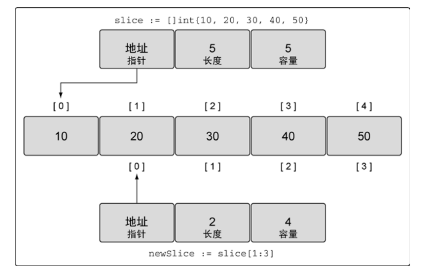
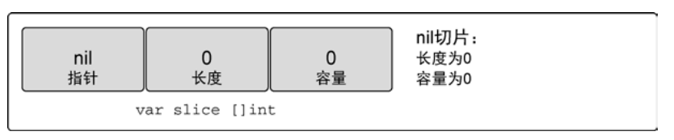
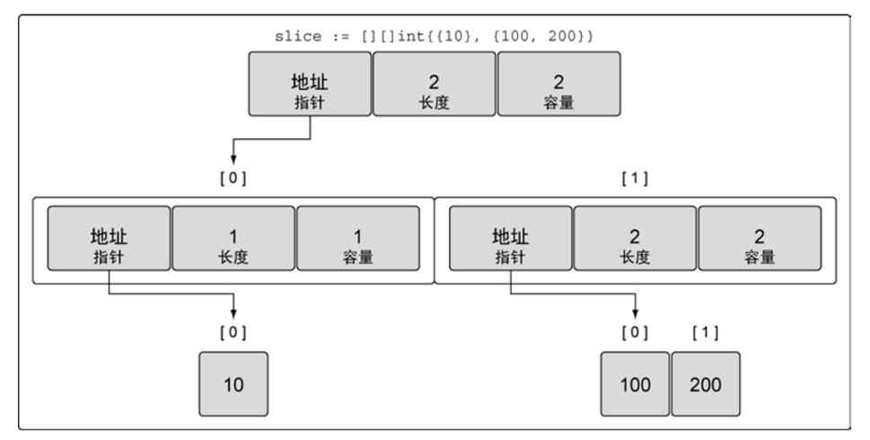
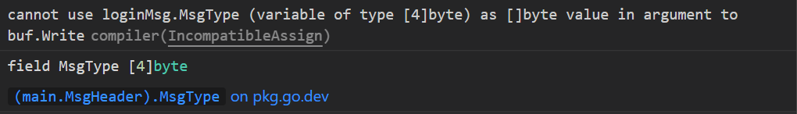
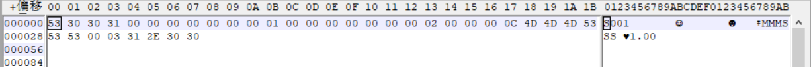

# 第四章、复合数据类型

## 4.1 数组

数组是一个由固定长度的特定类型元素组成的序列，一个数组可以由零个或多个元素组成。类型可以是内置类型，也可以是某个结构类型。

和数组对应的类型是slice，是可以增长和收缩的动态序列。

### 4.1.1 声明和初始化

声明数组时指定存储的数据类型，以及需要存储的元素的数量。通过对应类型的零值进行初始化。

一种快速创建数组并初始化的方式是使用数组字面量：

```go
array := [5]int{10, 20, 30, 40, 50}
```

在数组字面值中，如果在数组的长度位置出现的是“...”省略号，则表示数组的长度是根据初始化值的个数来计算:

```go
array := [...]int{10, 20, 30, 40, 50}
```

### 4.1.2 使用

数组遍历，通过range[返回索引和值](array.go)：

```go
package main

import "fmt"

func main() {
    var a [3]int
    fmt.Println(a[0])
    fmt.Println(len(a))
    
    for i, v := range a{
        fmt.Printf("%d %d\n", i, v)
    }
}
```


也可以指定一个索引和对应值列表的方式初始化：

```go
type Currency int

const (
    USD Currency = iota // 美元
    EUR                 // 欧元
    GBP                 // 英镑
    RMB                 // 人民币
)

symbol := [...]string{USD: "$", EUR: "€", GBP: "￡", RMB: "￥"}

fmt.Println(RMB, symbol[RMB]) // "3 ￥"
```

Go语言中，数组是一个值，可以进行赋值操作。需要是相同类型，数组变量的类型包括数组长度和每个元素的类型。

**iota是golang语言的常量计数器，该关键字让编译器为每个常量复制相同的表达式，直到声明区结束，或者遇到一个新的赋值语句。**
另外一个功能是iota初始值为0，之后iota的值每次处理为常量后，都会自增1。

```go
const ( 
Ldate = 1 << iota // 1 << 0 = 000000001 = 1 
Ltime // 1 << 1 = 000000010 = 2 
Lmicroseconds // 1 << 2 = 000000100 = 4 
Llongfile // 1 << 3 = 000001000 = 8 
Lshortfile // 1 << 4 = 000010000 = 16
... ) 
```


### 4.1.3 多维数组

数组本身只有一个维度，不过可以组合多个数组创建多维数组。多维数组很容易管理具有父子关系的数据或者与坐标系相关联的数据。

```go
// 声明一个二维整型数组，两个维度分别存储 4个元素和 2个元素 
var array [4][2]int
// 使用数组字面量来声明并初始化一个二维整型数组
array := [4][2]int{{10, 11}, {20, 21}, {30, 31}, {40, 41}} 
// 声明并初始化外层数组中索引为  1个和  3的元素
array := [4][2]int{1: {20, 21}, 3: {40, 41}} 
// 声明并初始化外层数组和内层数组的单个元素
array := [4][2]int{1: {0: 20}, 3: {1: 41}}
```


**注意第三个赋值类型，指定了单个元素：**第一个1:做外层的序号，第二0:为内层的序号。


### 4.1.4 函数之间传递数组

在函数之间传递变量，总是以值的方式传递。如果是数组需要完整赋值，开销很大。可以通过传递数组指针。

### 4.1.5 数组间比较

可以通过操作符==或者!= 进行数组比较。如果数组元素的值是可以比较的，则数组是可以比较的。他们对应的元素相等，则两个数组相等。比如：byte数组。

```go
	//基本类型，数组比较:
	b1 := [4]byte{'a', 'b', 'c'}
	b2 := [4]byte{'a', 'b', 'c'}
	if b1 == b2 {
		fmt.Println("the two array equal")
	}
```


## 4.2 slice

Slice（切片）代表变长的序列，序列中每个元素都有相同的类型。一个slice类型一般写作[]T，其中T代表slice中元素的类型；slice的语法和数组很像，只是没有固定长度而已。

一个slice由三个部分构成：指针、长度和容量，内置的len和cap函数分别返回slice的长度和容量。

### 4.2.1 创建和初始化

**make和切片字面量**

使用内置的make函数，传入长度参数，如果只指定长度，切片的容量和长度相同。

**使用索引声明切片**

```go
months := [...]string{1: "January", /* ... */, 12: "December"}
```

因此一月份是months[1]，十二月份是months[12]。通常，数组的第一个元素从索引0开始，但是月份一般是从1开始的，因此我们声明数组时直接跳过第0个元素，第0个元素会被自动初始化为空字符串。
**使用切片创建切片**

```go
// 创建一个整型切片
// 其长度和容量都是  5个元素
slice := []int{10, 20, 30, 40, 50} // 创建一个新切片
// 其长度为 2个元素，容量为 4个元素 newSlice := slice[1:3]
```



两个切片共享同一段底层数组，但通过不同的切片会看到底层数组的不同部分。

对底层数组容量是  k的切片  slice[i:j]：

- 长度: j - i 
- 容量: k - i 。


### 4.2.2 nil切片

```go
var slice []int
```



函数要求返回一个切片，但发生异常时可以返回nil。 

### 4.2.3 空切片

空切片底层数组包含0个元素，也没有分配任何存储空间。比如在数据库查询时，返回0个查询结果。

### 4.2.4 使用

**append函数**
内置的append函数用于向slice追加元素，[参见](append.go)：

```go
var x []int
x = append(x, 1)
x = append(x, 2, 3)
x = append(x, 4, 5, 6)
x = append(x, x...) // append the slice x
fmt.Println(x)      // "[1 2 3 4 5 6 1 2 3 4 5 6]"
```

需要一个被操作的切片和一个要追加的值。

**迭代切片**

```go
for index, value := range slice {
```

关键字range返回两个值，第一个值是当前迭代到的索引位置，第二个值是该位置对应元素值的一份副本。**是返回了副本而不是对该元素的引用。**

### 4.2.5 多维切片

声明多维切片：

```go
// 创建一个整型切片的切片
slice := [][]int{{10}, {100, 200}}
```



外层的 切片包括两个元素，每个元素都是一个切片。第一个元素中的切片使用单个整数 10 来初始化， 第二个元素中的切片包括两个整数，即 100 和 200。

### 4.2.6 函数间传递切片

在函数间传递切片就是要在函数间以值的方式传递切片。由于切片的尺寸很小，在函数间复制和传递切片成本也很低。

```go
// 分配包含  100万个整型值的切片 
slice := make([]int, 1e6)
// 将  slice传递到函数  
foo slice = foo(slice)
// 函数  foo接收一个整型切片，并返回这个切片 
func foo(slice []int) []int {
...
return slice } 
```

在 64 位架构的机器上，一个切片需要 24 字节的内存：指针字段需要 8  字节，长度和容量字段分别需要 8 字节。

因为切片关联的数据包含在底层数组里面，不属于切片本身，所以将切片 复制到任意函数的时候，对底层数组大小都不会有影响。

## 4.3 Map类型

哈希表是一种巧妙并且实用的数据结构。它是一个无序的key/value对的集合，**其中所有的key都是不同的**，然后通过给定的key可以在常数时间复杂度内检索、更新或删除对应的value。

一个map就是一个哈希表的引用，map类型可以写为map[K]V，其中K和V分别对应key和value。map中所有的key都有相同的类型，所有的value也有着相同的类型，但是key和value之间可以是不同的数据类型。

### 4.3.1 创建和初始化

**使用make声明映射**

```go
ages := make(map[string]int) // mapping from strings to ints
ages := map[string]int{
    "alice":   31,
    "charlie": 34,
}
```

映射的值可以是任何值。可以是内置类型，可以是结构类型，只要这个值可以使用==运算符进行比较。

**使用切片作为映射的值**

```go
// 创建一个映射，使用字符串切片作为值 
dict := map[int][]string{}
```


## 4.3.2 使用映射

使用内置的delete函数可以删除元素：

```go
delete(ages, "alice")
```


从映射取值时有两个选择。第一个选择是，可以同时获得值以及一个表示这个键是否存在的标志。

```go
value, exist := ages["alice"]
//这个键存在吗？
if exist {

}
```

另外一个选择是，只返回键对应的值，然后通过这个值是不是零值来确定键是否存在。

```go
value, exist := ages["alice"]
//这个键存在吗？
if value != "" {
    
}
```

通过关键字range迭代映射里面的所有值，返回的是键值对。


### 4.3.3 函数间传递映射

在函数间传递映射并不会制造出该映射的一个副本。当传递映射给一个函数，并对这个映射做了修改时，所有对这个映射的引用都会觉察到这个修改。


## 4.4 结构体

结构体是一种聚合的数据类型，是由零个或多个任意类型的值聚合成的实体。每个值称为结构体的成员。

下面两个语句声明了一个叫Employee的命名的结构体类型，并且声明了一个Employee类型的变量dilbert：

```go
type Employee struct {
    ID        int
    Name      string
    Address   string
    DoB       time.Time
    Position  string
    Salary    int
    ManagerID int
}

var dilbert Employee
```

结构体变量的成员可以通过点操作符访问。

结构体指针:

```go
var employeeOfTheMonth *Employee = &dilbert
```

### 4.4.1 结构体字面值

结构体值也可以用结构体字面值表示，结构体字面值可以指定每个成员的值。

```go
type Point struct{ X, Y int }

p := Point{1, 2}
```


### 4.4.2 结构体比较

如果结构体的全部成员都是可以比较的，那么结构体也是可以比较的，那样的话两个结构体将可以使用==或!=运算符进行比较。


### 4.4.3 结构体嵌入和匿名成员

可以通过嵌入匿名结构体的方式，可以直接访问匿名结构体的方法，实现继承。


### 4.4.4 结构体变量赋值

可以通过键值的方式，通过":"分隔。结构体字面值：

```go
user{
    name:      "Lisa",
    email:     "lisa@email.com",
    ext:       123,
    privileged: true, 
    }
```

对于字段的声明顺序没有要求。

不使用字段名称，创建结构类型的值。

```go
lisa := user{"Lisa", "lisa@email.com", 123, true}
```

结尾不需要逗号，但是值的顺序需要和结构体中声明的字段顺序一致。

使用其他结构类型声明字段

```go
// admin需要一个  user类型作为管理者，并附加权限
type admin struct {
   person user
   level string 
 }
```

为了初始化person，创建user结构类型，并赋给person字段。


### 4.4.5结构体对齐

类似C语言中的struct padding，编译器会进行优化处理，通过对齐的方式提升内存读取速度。

And in Go “required alignment” is used. Its value is equal to the size of the memory required for the largest field in the structure.

要求对齐的值是结构体中占用的内存最大的字段的值。也就是说，如果结构中只有int32字段，则“所需要的对齐方式”将为4个字节，并且如果同时有int32和int64，那么为8个字节。


比如：


### 4.4.6 空结构体

结构体类型没有字段，比如：

```go
type Q struct{}
var q struct{}
```

宽度Width

宽度描述了一个类型的实体所占用的存储字节数目。通过```unsafe.Sizeof()```方法获取类型的宽度。

数组类型的宽度等于元素类型的宽度乘以数目。

```go
    var a [3]uint32
    fmt.Println(unsafe.Sizeof(a)) // prints 12
```


空结构体宽度为0：

```go
var s struct{}
fmt.Println(unsafe.Sizeof(s)) // prints 0
```

因为空结构体占用0个字节，跟在之后的类型不需要padding，因此如果一个结构体由空结构体组成，也不占用空间：

```go
type S struct {
        A struct{}
        B struct{}
}
var s S
fmt.Println(unsafe.Sizeof(s)) // prints 0
```


遵循Go语言的正交性，空结构体是和其他类型相同的类型。

```go
var x [1000000000]struct{}
fmt.Println(unsafe.Sizeof(x)) // prints 0
```

空结构体类型的切片也只占用切片头部的长度，背后的数组长度为0.

### 4.4.7 结构体转为byte数组

在网络编程时通常根据会话协议，发送和接收消息体，完成用户验证。通过定义消息结构体，转换为byte二进制数据之后发送到服务器。可以通过bytes.Buffer将结构体中各成员变量放置到buffer中。

假设消息结构体由消息头和消息体组成，定义如下：

```go
type MsgHeader struct {
	MsgType      [4]byte
	SendingTtime uint64
	MsgSeq       uint64
	BodyLength   uint32
}
```

消息类型的长度为4字节，发送时间字段长度为8字节，消息序号字段长度为8字节，消息长度字段为4字节。一共长度为：24字节。

消息体定义如下：

```go
type LoginMsg struct {
	MsgHeader
	SenderCompID [3]byte
	TargetCompID [3]byte
	HeartBtInt   uint16
	AppVerID     [4]byte
}
```

LoginMsg可以直接访问MsgHeader中的成员。消息体中发送ID字段长度为3，目标ID字段长度为3，心跳字段长度为2，应用版本字段长度为4，一共12个字节。整个LoginMsg消息体长度为36个字节。

定义bytes.Buffer变量，将结构体中的字节数组直接写入，对于整数类型，可以选择不同“大端”或者“小端“方式进行写入。

初始化消息结构体：

```go
	var loginMsg LoginMsg
	loginMsg.MsgType = [4]byte{'S', '0', '0', '1'}
	loginMsg.SendingTtime = 1
	loginMsg.MsgSeq = 2
	loginMsg.BodyLength = 12
	loginMsg.SenderCompID = [3]byte{'M', 'M', 'M'}
	loginMsg.TargetCompID = [3]byte{'S', 'S', 'S'}
	loginMsg.HeartBtInt = 3
	loginMsg.AppVerID = [4]byte{'1', '.', '0', '0'}
```

创建bytes.Buffer将结构体中的字段写入：

```go
	buf := new(bytes.Buffer)
	//写入消息类型，
	buf.Write(loginMsg.MsgType[:])
```

**需要注意的是：**buf.write方法参数为[]byte序列，如果传入loginMsg.MsgType，报错：



因为loginMsg.MsgType是字节数组。需要通过[:]创建一个切片。写入其他字段：

```go
	buf := new(bytes.Buffer)
	//写入消息类型，
	buf.Write(loginMsg.MsgType[:])
	//按照大端写入发送时间
	binary.Write(buf, binary.BigEndian, loginMsg.SendingTtime)
	//写入消息序号
	binary.Write(buf, binary.BigEndian, loginMsg.MsgSeq)
	//写入消息体长度
	binary.Write(buf, binary.BigEndian, loginMsg.BodyLength)
	//写入发送ID
	buf.Write(loginMsg.SenderCompID[:])
	//写入目标ID
	buf.Write(loginMsg.TargetCompID[:])
	//写入心跳时间
	binary.Write(buf, binary.BigEndian, loginMsg.HeartBtInt)
	//写入版本信息
	buf.Write(loginMsg.AppVerID[:])
```

其中，对于整数类型的字段，可以通过```binary```包中大端或者小端的方式写入。

最后将byte序列写入到文件中：

```go
	//将这些byte数据写入到文件中
	f, err := os.Create("struct.bin")
	if err != nil {
		fmt.Println("open file error.")
	}
	defer f.Close()
	n, err := f.Write(buf.Bytes())
	if err != nil {
		fmt.Println("write file failed.")
	}
	fmt.Println("write file len is:", n)
```

然后我们通过十六进制编辑器打开该二进制文件。笔者通过wxHexEditor：



可以发现：前四个字节十六进制表示为53、30、30、31。根据ASCII码表，53表示”S“，30表示”0“，31表示”1“。

后8个字节位：00 00 00 00 00 00 00 01，SendingTtime字段类型为uint64，共计8个字节，按照大端方式表示。


## 4.5 JSON

JSON是对JavaScript中各种类型的值——字符串、数字、布尔值和对象——Unicode本文编码。它可以用有效可读的方式表示第三章的基础数据类型和本章的数组、slice、结构体和map等聚合数据类型。

```go
type Movie struct {
    Title  string
    Year   int  `json:"released"`
    Color  bool `json:"color,omitempty"`
    Actors []string
}

var movies = []Movie{
    {Title: "Casablanca", Year: 1942, Color: false,
        Actors: []string{"Humphrey Bogart", "Ingrid Bergman"}},
    {Title: "Cool Hand Luke", Year: 1967, Color: true,
        Actors: []string{"Paul Newman"}},
    {Title: "Bullitt", Year: 1968, Color: true,
        Actors: []string{"Steve McQueen", "Jacqueline Bisset"}},
    // ...
}
```

这样的数据结构特别适合JSON格式，并且在两者之间相互转换也很容易。将一个Go语言中类似movies的结构体slice转为JSON的过程叫编组（marshaling）。编组通过调用json.Marshal函数完成：

```go
data, err := json.Marshal(movies)
if err != nil {
    log.Fatalf("JSON marshaling failed: %s", err)
}
fmt.Printf("%s\n", data)
```

## 4.6 文本和HTML模板

一个模板是一个字符串或一个文件，里面包含了一个或多个由双花括号包含的`{{action}}`对象。

actions部分将触发其它的行为。下面是一个简单的模板字符串:

```go
const templ = `{{.TotalCount}} issues:
{{range .Items}}----------------------------------------
Number: {{.Number}}
User:   {{.User.Login}}
Title:  {{.Title | printf "%.64s"}}
Age:    {{.CreatedAt | daysAgo}} days
{{end}}`
```

模板中`{{range .Items}}`和`{{end}}`对应一个循环action，因此它们之间的内容可能会被展开多次，循环每次迭代的当前值对应当前的Items元素的值。

在一个action中，`|`操作符表示将前一个表达式的结果作为后一个函数的输入，类似于UNIX中管道的概念。


## 4.7 嵌入类型

Go 语言允许用户扩展或者修改已有类型的行为。嵌入类 型是将已有的类型直接声明在新的结构类型里。被嵌入的类型被称为新的外部类型的内部类型。

结构体基于字段名称和字段类型，也可以只有字段类型，这种声明方式称为类型嵌入。

```go
type Base struct {
  b int
}


type Container struct {     // Container is the embedding struct
  Base                      // Base is the embedded struct
  c string
}
```

Container实例也包含了字段b，称为提升类型（*promoted* field），直接访问：

```go
co := Container{}
co.b = 1
co.c = "string"
fmt.Printf("co -> {b: %v, c: %v}\n", co.b, co.c)
```

co.b格式为了语法便利，可以通过co.Base.b访问。

嵌入的结构体仍然可以使用方法：

```go
func (base Base) Describe() string {
  return fmt.Sprintf("base %d belongs to us", base.b)
}
```

可以通过Container的实例访问：

```go
fmt.Println(cc.Describe())
```


## 4.8 参考

[数组、字符串和切片](https://chai2010.gitbooks.io/advanced-go-programming-book/content/ch1-basic/ch1-03-array-string-and-slice.html)

https://developpaper.com/six-lines-of-code-to-quickly-solve-the-golang-tcp-packet-sticking-problem/