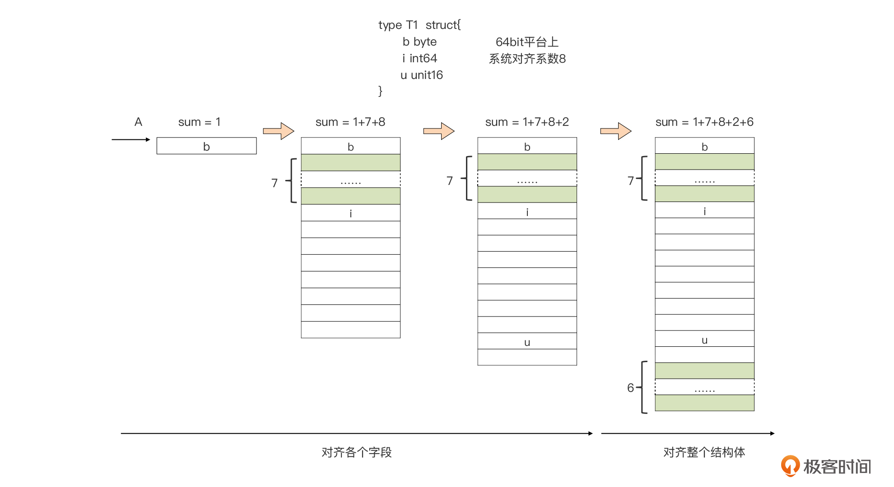

# 第四章、复合数据类型

## 4.1 数组

数组是一个由固定长度的特定类型元素组成的序列，一个数组可以由零个或多个元素组成。类型可以是内置类型，也可以是某个结构类型。包含了两个重要的属性：元素的类型和数组长度（元素的个数）。

和数组对应的类型是slice，是可以增长和收缩的动态序列。

### 4.1.1 声明和初始化

声明数组时指定存储的数据类型，以及需要存储的元素的数量。通过对应类型的零值进行初始化。

```go
var arr [N]T
```

只能用整型数字面值或常量表达式作为 N 值。

一种快速创建数组并初始化的方式是使用数组字面量：

```go
array := [5]int{10, 20, 30, 40, 50}
```

在数组字面值中，如果在数组的长度位置出现的是“...”省略号，则表示数组的长度是根据初始化值的个数来计算:

```go
array := [...]int{10, 20, 30, 40, 50}
```

预定义函数len可以用于获取一个数组**类型变量的长度**，通过 unsafe 包提供的 Sizeof 函数，我们可以获得一个数组变量的总大小。

```go
    var arr = [5]int{1, 2, 3, 4, 5}
    fmt.Println("数组长度:", len(arr))
    fmt.Println("数组大小:", unsafe.Sizeof(arr))
```

运行结果：


在 64 位平台上，int 类型的大小为 8，数组 arr 一共有 5个元素，因此它的总大小为 5x8=40 个字节。

但是如果要对长度较大的稀疏数组进行显示初始化，逐一赋值非常繁琐，可以使用下标赋值的方式对它进行初始化：

```go
type Currency int

const (
    USD Currency = iota // 美元
    EUR                 // 欧元
    GBP                 // 英镑
    RMB                 // 人民币
)

symbol := [...]string{USD: "$", EUR: "€", GBP: "￡", RMB: "￥"}

fmt.Println(RMB, symbol[RMB]) // "3 ￥"
```

通过“下标：值”的方式进行赋值。

**iota是Go中的常量计数器，该关键字让编译器为每个常量复制相同的表达式，直到声明区结束，或者遇到一个新的赋值语句，[可以参考]()。**

### 4.1.2 数组遍历

数组遍历是最通常的使用方法，通过range[返回索引和值](array.go)：

```go
package main

import "fmt"

func main() {
    var a [3]int
    fmt.Println(a[0])
    fmt.Println(len(a))
    
    for i, v := range a{
        fmt.Printf("%d %d\n", i, v)
    }
}
```


### 4.1.3 多维数组

数组本身只有一个维度，不过可以组合多个数组创建多维数组。多维数组很容易管理具有父子关系的数据或者与坐标系相关联的数据。

```go
// 声明一个二维整型数组，两个维度分别存储 4个元素和 2个元素 
var array [4][2]int
// 使用数组字面量来声明并初始化一个二维整型数组
array := [4][2]int{{10, 11}, {20, 21}, {30, 31}, {40, 41}} 
// 声明并初始化外层数组中索引为  1个和  3的元素
array := [4][2]int{1: {20, 21}, 3: {40, 41}} 
// 声明并初始化外层数组和内层数组的单个元素
array := [4][2]int{1: {0: 20}, 3: {1: 41}}
```


**注意第三个赋值类型，指定了单个元素：**第一个1:做外层的序号，第二0:为内层的序号。

从左向右逐维地去看，可以将一个多维数组分层拆解：


### 4.1.4 函数之间传递数组

数组变量是一个整体，一个数组变量表示的是整个数组，Go传递数组是整个的值拷贝，开销很大，可以通过传递数组指针。但是可以使用更为灵活的切片方式。

### 4.1.5 数组间比较

可以通过操作符==或者!= 进行数组比较。如果数组元素的值是可以比较的，则数组是可以比较的。他们对应的元素相等，则两个数组相等。比如：byte数组。

```go
	//基本类型，数组比较:
	b1 := [4]byte{'a', 'b', 'c'}
	b2 := [4]byte{'a', 'b', 'c'}
	if b1 == b2 {
		fmt.Println("the two array equal")
	}
```


## 4.2 切片

Slice（切片）代表变长的序列，序列中每个元素都有相同的类型。一个slice类型一般写作[]T，其中T代表slice中元素的类型；slice的语法和数组很像，只是没有固定长度而已。

一个slice由三个部分构成：指针、长度和容量，内置的len和cap函数分别返回slice的长度和容量。

### 4.2.1 声明和初始化

切片的声明比数组少了长度属性：

```go
var nums = []int{1, 2, 3, 4, 5, 6}
```

虽然没有声明长度，但是切片也有自己的长度，只是长度不是固定的，而是随着切片中元素个数的变化而变化的。

**make函数创建切片**

使用内置的make函数，传入长度参数，如果只指定长度，切片的容量和长度相同。

```go
sl := make([]byte, 6, 10) // 其中10为cap值，即底层数组长度，6为切片的初始长度
```


**使用索引声明切片**

```go
months := [...]string{1: "January", /* ... */, 12: "December"}
```

因此一月份是months[1]，十二月份是months[12]。通常，数组的第一个元素从索引0开始，但是月份一般是从1开始的，因此我们声明数组时直接跳过第0个元素，第0个元素会被自动初始化为空字符串。
**使用切片创建切片**

```go
// 创建一个整型切片
// 其长度和容量都是  5个元素
slice := []int{10, 20, 30, 40, 50} // 创建一个新切片
// 其长度为 2个元素，容量为 4个元素 
newSlice := slice[1:3]
```


两个切片共享同一段底层数组，但通过不同的切片会看到底层数组的不同部分。

对底层数组容量是  k的切片  slice[i:j]：

- 长度: j - i 
- 容量: k - i 。

**采用array[low : high : max]创建**

基于一个已存在的数组创建切片，即：数组的切片化：

```go
arr := [10]int{1, 2, 3, 4, 5, 6, 7, 8, 9, 10}
sl := arr[3:7:9]
```


它的起始元素从 low 所标识的下标值开始，切片的长度（len）是 high - low，它的容量是 max - low。


### 4.2.2 nil切片

```go
var slice []int
```


函数要求返回一个切片，但发生异常时可以返回nil。 

### 4.2.3 空切片

空切片底层数组包含0个元素，也没有分配任何存储空间。比如在数据库查询时，返回0个查询结果。

```go
var slice = []int{}
```


### 4.2.4 使用

**append函数**
内置的append函数用于向slice追加元素，[参见](append.go)：

```go
var x []int
x = append(x, 1)
x = append(x, 2, 3)
x = append(x, 4, 5, 6)
x = append(x, x...) // append the slice x
fmt.Println(x)      // "[1 2 3 4 5 6 1 2 3 4 5 6]"
```

需要一个被操作的切片和一个要追加的值。

**需要注意的是，**如果append自动扩容，追加的数据操作触碰到切片的容量上限，切片就和原数组解绑，后续对切片的任何修改都不会反映到原数组中了。

```go
package main

import(
    "fmt"
)


func main() {
    u := [...]int{1,2,3,4}
    
    s := u[1:2]
    
    fmt.Printf("slice(len=%d,cap=%d):%v\n", len(s), cap(s), s)
    
    fmt.Println("array:", u)
        
    s = append(s, 5)
    fmt.Println("after append 5, array:", u)
    
    s = append(s, 6)
    fmt.Println("after append 6, array:", u)
    
    s = append(s, 7)
    fmt.Println("after append 7, array:", u)
    

}
```

切片s的长度为：2-1=1，容量为4:1=3。


**迭代切片**

```go
for index, value := range slice {
```

关键字range返回两个值，第一个值是当前迭代到的索引位置，第二个值是该位置对应元素值的一份副本。**是返回了副本而不是对该元素的引用。**

### 4.2.5 多维切片

声明多维切片：

```go
// 创建一个整型切片的切片
slice := [][]int{{10}, {100, 200}}
```


外层的 切片包括两个元素，每个元素都是一个切片。第一个元素中的切片使用单个整数 10 来初始化， 第二个元素中的切片包括两个整数，即 100 和 200。

### 4.2.6 函数间传递切片

在函数间传递切片就是要在函数间以值的方式传递切片。由于切片的尺寸很小，在函数间复制和传递切片成本也很低。

```go
// 分配包含  100万个整型值的切片 
slice := make([]int, 1e6)
// 将  slice传递到函数  
foo slice = foo(slice)
// 函数  foo接收一个整型切片，并返回这个切片 
func foo(slice []int) []int {
...
return slice } 
```

在 64 位架构的机器上，一个切片需要 24 字节的内存：指针字段需要 8  字节，长度和容量字段分别需要 8 字节。

因为切片关联的数据包含在底层数组里面，不属于切片本身，所以将切片 复制到任意函数的时候，对底层数组大小都不会有影响。

### 4.2.7 切片实现

Go切换表示如下：

```go

type slice struct {
    array unsafe.Pointer
    len   int
    cap   int
}
```

array: 是指向底层数组的指针；

len: 是切片的长度，即切片中当前元素的个数；

cap: 是底层数组的长度，也是切片的最大容量，cap 值永远大于等于 len 值。


## 4.3 Map类型

哈希表是一种巧妙并且实用的数据结构。它是一个无序的key/value对的集合，**其中所有的key都是不同的**，然后通过给定的key可以在常数时间复杂度内检索、更新或删除对应的value。

一个map就是一个哈希表的引用，map类型可以写为map[K]V，其中K和V分别对应key和value。map中所有的key都有相同的类型，所有的value也有着相同的类型，但是**key和value之间可以是不同的数据类型**。

因为 map 类型要保证 key 的唯一性。Go 语言中要求，key 的类型必须支持“==”和“!=”两种比较操作符。

### 4.3.1 创建和初始化

**声明map变量**

```go
var m map[string]int // 一个map[string]int类型的变量
```

map 类型变量的默认值为 nil。


**使用make声明映射**

```go
ages := make(map[string]int) // mapping from strings to ints
ages := map[string]int{
    "alice":   31,
    "charlie": 34,
}
```

映射的值可以是任何值。可以是内置类型，可以是结构类型，只要这个值可以使用==运算符进行比较。

**使用切片作为映射的值**

```go
// 创建一个映射，使用字符串切片作为值 
dict := map[int][]string{}
```

字符串切片作为map的值。

### 4.3.2 基本操作

#### 4.3.2.1 插入新的键值

把value赋值给map中对应的key：

```go
m := make(map[int]string)
m[1] = "value1"
m[2] = "value2"
m[3] = "value3"
```

如果key已经存在，插入操作会用新值替换旧值：

```go
m := map[string]int {
  "key1" : 1,
  "key2" : 2,
}

m["key1"] = 11 // 11会覆盖掉"key1"对应的旧值1
m["key3"] = 3  // 此时m为map[key1:11 key2:2 key3:3]
```

#### 4.3.2.2 获取键值对数量

map 类型也可以通过内置函数 len，获取当前变量已经存储的键值对数量：

```go
m := map[string]int {
  "key1" : 1,
  "key2" : 2,
}

fmt.Println(len(m)) // 2
m["key3"] = 3  
fmt.Println(len(m)) // 3
```

**需要注意的是：不能对 map 类型变量调用 cap，来获取当前容量。**

#### 4.3.2.3 查找和数据读取

```go

m := make(map[string]int)
v := m["key1"]
```

上述查找做法，无法确定键 key1 是否真实存在于 map 中。如果这个键在 map 中并不存在，我们也会得到一个值，这个值是 value 元素类型的**零值**。

通过“comma ok”的惯用法：

```go

m := make(map[string]int)
v, ok := m["key1"]
if !ok {
    // "key1"不在map中
}

// "key1"在map中，v将被赋予"key1"键对应的value
```

如果只是关心某个键是否在于 map 中，我们可以使用空标识符替代变量 v，忽略可能返回的 value：

```go
m := make(map[string]int)
_, ok := m["key1"]
... ...
```

#### 4.2.3.4 删除数据

使用内置的delete函数传给 delete 的键在 map 中并不存在，delete 函数的执行也不会失败，更不会抛出运行时的异常。删除元素：

```go
delete(ages, "alice")
```

传给 delete 的键在 map 中并不存在，**delete 函数的执行也不会失败，更不会抛出运行时的异常。**

#### 4.2.3.5 遍历map中的键值数据

通过for range语句迭代映射里面的所有值，[返回键值对](map.go)：

```go

func doIteration(m map[int]int) {
    fmt.Printf("{ ")
    for k, v := range m {
        fmt.Printf("[%d, %d] ", k, v)
    }
    fmt.Printf("}\n")
}

func main() {
    m := make(map[string]int)
    v := m["key1"]
    fmt.Println(v)
    
    
    //iterator
    n := map[int]int{
    1: 11,
    2: 12,
    3: 13,
    }

    for i := 0; i < 3; i++ {
        doIteration(n)
    }
    
}
```

输出结果如下：


对同一 map 做多次遍历的时候，每次遍历元素的次序都不相同，**程序逻辑千万不要依赖遍历 map 所得到的的元素次序。**


### 4.3.3 函数间传递映射

在函数间传递映射并不会制造出该映射的一个副本。当传递映射给一个函数，并对这个映射做了修改时，所有对这个映射的引用都会觉察到这个修改。

```go

func modMapValue(m map[int]int) {
    
    //修改map
    m[2] = 15
}


func main() {
   
    //init
    m := map[int]int{
    1: 11,
    2: 12,
    3: 13,
    }

    modMapValue(m)
    v, ok := m[2]
    if ok {
        fmt.Println(v)
    }
}
```

对key为2的值通过函数进行修改，输出结果为15。


## 4.4 结构体

### 4.4.1 结构体定义

结构体是一种聚合的数据类型，是由零个或多个任意类型的值聚合成的实体。每个值称为结构体的成员。

下面两个语句声明了一个叫Employee的命名的结构体类型，并且声明了一个Employee类型的变量dilbert：

```go
type Employee struct {
    ID        int
    Name      string
    Address   string
    DoB       time.Time
    Position  string
    Salary    int
    ManagerID int
}

var dilbert Employee
```

结构体变量的成员可以通过点操作符访问。

结构体指针:

```go
var employeeOfTheMonth *Employee = &dilbert
```


#### 4.4.1.1 空结构体

结构体类型没有包含任何字段，比如：

```go
type Q struct{}
var q struct{}
```

宽度描述了一个类型的实体所占用的存储字节数目。通过```unsafe.Sizeof()```方法获取类型的宽度。

数组类型的宽度等于元素类型的宽度乘以数目。

```go
    var a [3]uint32
    fmt.Println(unsafe.Sizeof(a)) // prints 12
```

空结构体宽度为0：

```go
var s struct{}
fmt.Println(unsafe.Sizeof(s)) // prints 0
```

因为空结构体占用0个字节，跟在之后的类型不需要padding，因此如果一个结构体由空结构体组成，也不占用空间：

```go
type S struct {
        A struct{}
        B struct{}
}
var s S
fmt.Println(unsafe.Sizeof(s)) // prints 0
```

遵循Go语言的正交性，空结构体是和其他类型相同的类型。

```go
var x [1000000000]struct{}
fmt.Println(unsafe.Sizeof(x)) // prints 0
```

空结构体类型的切片也只占用切片头部的长度，背后的数组长度为0.

可以使用空结构体类型元素，作为一种“事件”信息进行 Goroutine 之间的通信。

```go
type Empty struct{} // Empty是一个不包含任何字段的空结构体类型
```


```go
var c = make(chan Empty) // 声明一个元素类型为Empty的channel
c<-Empty{}               // 向channel写入一个“事件”
```


### 4.4.1.2 结构体字面值

结构体值也可以用结构体字面值表示，结构体字面值可以指定每个成员的值。

```go
type Point struct{ X, Y int }

p := Point{1, 2}
```


### 4.4.2 结构体比较

如果结构体的全部成员都是可以比较的，那么结构体也是可以比较的，那样的话两个结构体将可以使用==或!=运算符进行比较。


### 4.4.3 结构体嵌入和匿名成员

包含结构体类型字段的结构体类型来说，可以使用其他结构体作为自定义结构体中字段的类型。可以不需要提供字段的名字，使用其类型即可。

```go

type Book struct {
    Title string
    Person
    ... ...
}
```

已这种方式定义的结构体字段，称为**嵌入字段（Embedded Field）**。或者匿名字段。


```go
type Base struct {
  b int
}


type Container struct {     // Container is the embedding struct
  Base                      // Base is the embedded struct
  c string
}
```

Container实例也包含了字段b，称为提升类型（*promoted* field），可以直接访问：

```go
co := Container{}
co.b = 1
co.c = "string"
fmt.Printf("co -> {b: %v, c: %v}\n", co.b, co.c)
```

co.b格式为了语法便利，可以通过co.Base.b访问。

也可以访问嵌入类型的方法：

```go
func (base Base) Describe() string {
  return fmt.Sprintf("base %d belongs to us", base.b)
}
```

可以通过Container的实例访问：

```go
fmt.Println(cc.Describe())
```


但是结构体类型T的定义中不能够包含类型为T的字段。但可以拥有自身类型的指针类型、以自身类型为元素类型的切片类型，以及以自身类型作为 value 类型的 map 类型的字段：

```go
type T struct {
    t  *T           // ok
    st []T          // ok
    m  map[string]T // ok
}     
```


### 4.4.4 结构体声明和初始化

#### 4.4.4.1 零值初始化

Go 结构体类型由若干个字段组成，当这个结构体类型变量的各个字段的值都是零值时，我们就说这个结构体类型变量处于零值状态。

```go
var book Book // book为零值结构体变量
```

但对于像 Book 这样的结构体类型，使用零值初始化并不是正确的选择。

```go
var b bytes.Buffer
b.Write([]byte("Hello, Go"))
fmt.Println(b.String()) // 输出：Hello, Go
```


#### 4.4.4.2 使用复合字面值

按顺序依次给每个结构体字段进行赋值：

```go
type Book struct {
    Title string              // 书名
    Pages int                 // 书的页数
    Indexes map[string]int    // 书的索引
}

var book = Book{"The Go Programming Language", 700, make(map[string]int)}
```

但是这种初始化方法存在问题：

- 字段顺序发生变化，就需要手动调整该结构体类型变量的显式初始化代码，让赋值顺序与调整后的字段顺序一致；
- 当一个结构体的字段较多时，这种逐一字段赋值的方式实施起来就会比较困难；
- 一旦结构体中**包含非导出字段**，那么这种逐一字段赋值的方式就不再被支持了，编译器会报错。

#### 4.4.4. 3  "field:value”形式的复合字面值

通过field:value形式，对结构体类型变量进行显式初始化：

```go
user{
    name:      "Lisa",
    email:     "lisa@email.com",
    ext:       123,
    privileged: true, 
    }
```

对于字段的声明顺序没有要求。


### 4.4.5结构体对齐

结构体字段实际上可能并不是紧密相连的，中间可能存在“缝隙”。这些“缝隙”同样是结构体变量占用的内存空间的一部分，它们是 Go 编译器插入的“填充物（Padding）”。


类似C语言中的struct padding，编译器会进行优化处理，通过**内存对齐**的方式提升内存读取速度。

可以通过标准库unsafe包提供的函数，获得结构体类型变量占用的内存大小，以及它每个字段在内存中相对于结构体变量起始地址的偏移量：

```go

var t T
unsafe.Sizeof(t)      // 结构体类型变量占用的内存大小
unsafe.Offsetof(t.Fn) // 字段Fn在内存中相对于变量t起始地址的偏移量
```

对于各种基本数据类型来说，它的变量的内存地址值必须是其类型本身大小的整数倍，比如，一个 int64 类型的变量的内存地址，应该能被 int64 类型自身的大小，也就是 8 整除；一个 uint16 类型的变量的内存地址，应该能被 uint16 类型自身的大小，也就是 2 整除。

对于结构体而言，它的变量的内存地址，只要是它最长字段长度与系统对齐系数两者之间较小的那个的整数倍就可以了。但对于结构体类型来说，我们还要让它每个字段的内存地址都严格满足内存对齐要求。示例：

```go

type T struct {
    b byte
    i int64
    u uint16
}
```




计算结构体对齐系数。

- 第一个字段为byte，占用一个字节，字段b可以放在任意地址上面都可以为1整除，已经对齐的内存大小sum=1;
- 第二个字段为i，长度为8个字节，应该放到被8整除的地址，如果紧跟在b的后面，当 i 的地址可以被 8 整除时，b 的地址就无法被 8 整除。需要在 b 与 i 之间做一些填充，使得 i 的地址可以被 8 整除时，b 的地址也始终可以被 8 整除，于是我们在 i 与 b 之间填充了 7 个字节，此时此刻 sum=1+7+8；
- 第三个字段u是长度为 2 个字节的 uint16 类型变量，应该被放在能够被2整除的地址上。我们现在知道将 u 与 i 相邻而放，是可以满足其地址的对齐要求的。i 之后的那个字节的地址肯定可以被 8 整除，也一定可以被 2 整除。于是我们把 u 直接放在 i 的后面，中间不需要填充，此时此刻，sum=1+7+8+2。

现在所有的字段也都对齐了，，我们开始第二个阶段，也就是对齐整个结构体。

结构体的内存地址为 min（结构体最长字段的长度，系统内存对齐系数）的整数倍，那么这里结构体 T 最长字段为 i，它的长度为 8，而 64bit 系统上的系统内存对齐系数一般为 8，两者相同，我们取 8 就可以了。那么整个结构体的对齐系数就是 8。

**但是为什么还需要增加6？**

单个结构可以对齐，但是对于结构体数组来讲，能够保证对齐。

而数组是元素连续存储的一种类型，元素 T[1]的地址为 T[0]地址 +T 的大小 (18)，显然无法被 8 整除，这将导致 T[1]及后续元素的地址都无法对齐，这显然不能满足内存对齐的要求。从 18 开始向后找到第一个可以被 8 整除的数字24，作为类型 T 最终的大小就可以了。


因此结构体不同的顺序会导致他们的大小不同：

```go

type T struct {
    b byte
    i int64
    u uint16
}

type S struct {
    b byte
    u uint16
    i int64
}

func main() {
    var t T
    println(unsafe.Sizeof(t)) // 24
    var s S
    println(unsafe.Sizeof(s)) // 16
}
```


### 4.4.7 结构体转为byte数组

在网络编程时通常根据会话协议，发送和接收消息体，完成用户验证。通过定义消息结构体，转换为byte二进制数据之后发送到服务器。可以通过bytes.Buffer将结构体中各成员变量放置到buffer中。

假设消息结构体由消息头和消息体组成，定义如下：

```go
type MsgHeader struct {
	MsgType      [4]byte
	SendingTtime uint64
	MsgSeq       uint64
	BodyLength   uint32
}
```

消息类型的长度为4字节，发送时间字段长度为8字节，消息序号字段长度为8字节，消息长度字段为4字节。一共长度为：24字节。

消息体定义如下：

```go
type LoginMsg struct {
	MsgHeader
	SenderCompID [3]byte
	TargetCompID [3]byte
	HeartBtInt   uint16
	AppVerID     [4]byte
}
```

LoginMsg可以直接访问MsgHeader中的成员。消息体中发送ID字段长度为3，目标ID字段长度为3，心跳字段长度为2，应用版本字段长度为4，一共12个字节。整个LoginMsg消息体长度为36个字节。

定义bytes.Buffer变量，将结构体中的字节数组直接写入，对于整数类型，可以选择不同“大端”或者“小端“方式进行写入。

初始化消息结构体：

```go
	var loginMsg LoginMsg
	loginMsg.MsgType = [4]byte{'S', '0', '0', '1'}
	loginMsg.SendingTtime = 1
	loginMsg.MsgSeq = 2
	loginMsg.BodyLength = 12
	loginMsg.SenderCompID = [3]byte{'M', 'M', 'M'}
	loginMsg.TargetCompID = [3]byte{'S', 'S', 'S'}
	loginMsg.HeartBtInt = 3
	loginMsg.AppVerID = [4]byte{'1', '.', '0', '0'}
```

创建bytes.Buffer将结构体中的字段写入：

```go
	buf := new(bytes.Buffer)
	//写入消息类型，
	buf.Write(loginMsg.MsgType[:])
```

**需要注意的是：**buf.write方法参数为[]byte序列，如果传入loginMsg.MsgType，报错：


因为loginMsg.MsgType是字节数组。需要通过[:]创建一个切片。写入其他字段：

```go
	buf := new(bytes.Buffer)
	//写入消息类型，
	buf.Write(loginMsg.MsgType[:])
	//按照大端写入发送时间
	binary.Write(buf, binary.BigEndian, loginMsg.SendingTtime)
	//写入消息序号
	binary.Write(buf, binary.BigEndian, loginMsg.MsgSeq)
	//写入消息体长度
	binary.Write(buf, binary.BigEndian, loginMsg.BodyLength)
	//写入发送ID
	buf.Write(loginMsg.SenderCompID[:])
	//写入目标ID
	buf.Write(loginMsg.TargetCompID[:])
	//写入心跳时间
	binary.Write(buf, binary.BigEndian, loginMsg.HeartBtInt)
	//写入版本信息
	buf.Write(loginMsg.AppVerID[:])
```

其中，对于整数类型的字段，可以通过```binary```包中大端或者小端的方式写入。

最后将byte序列写入到文件中：

```go
	//将这些byte数据写入到文件中
	f, err := os.Create("struct.bin")
	if err != nil {
		fmt.Println("open file error.")
	}
	defer f.Close()
	n, err := f.Write(buf.Bytes())
	if err != nil {
		fmt.Println("write file failed.")
	}
	fmt.Println("write file len is:", n)
```

然后我们通过十六进制编辑器打开该二进制文件。笔者通过wxHexEditor：


可以发现：前四个字节十六进制表示为53、30、30、31。根据ASCII码表，53表示”S“，30表示”0“，31表示”1“。

后8个字节位：00 00 00 00 00 00 00 01，SendingTtime字段类型为uint64，共计8个字节，按照大端方式表示。


## 4.5 JSON

JSON是对JavaScript中各种类型的值——字符串、数字、布尔值和对象——Unicode本文编码。它可以用有效可读的方式表示第三章的基础数据类型和本章的数组、slice、结构体和map等聚合数据类型。

```go
type Movie struct {
    Title  string
    Year   int  `json:"released"`
    Color  bool `json:"color,omitempty"`
    Actors []string
}

var movies = []Movie{
    {Title: "Casablanca", Year: 1942, Color: false,
        Actors: []string{"Humphrey Bogart", "Ingrid Bergman"}},
    {Title: "Cool Hand Luke", Year: 1967, Color: true,
        Actors: []string{"Paul Newman"}},
    {Title: "Bullitt", Year: 1968, Color: true,
        Actors: []string{"Steve McQueen", "Jacqueline Bisset"}},
    // ...
}
```

这样的数据结构特别适合JSON格式，并且在两者之间相互转换也很容易。将一个Go语言中类似movies的结构体slice转为JSON的过程叫编组（marshaling）。编组通过调用json.Marshal函数完成：

```go
data, err := json.Marshal(movies)
if err != nil {
    log.Fatalf("JSON marshaling failed: %s", err)
}
fmt.Printf("%s\n", data)
```

## 4.6 文本和HTML模板

一个模板是一个字符串或一个文件，里面包含了一个或多个由双花括号包含的`{{action}}`对象。

actions部分将触发其它的行为。下面是一个简单的模板字符串:

```go
const templ = `{{.TotalCount}} issues:
{{range .Items}}----------------------------------------
Number: {{.Number}}
User:   {{.User.Login}}
Title:  {{.Title | printf "%.64s"}}
Age:    {{.CreatedAt | daysAgo}} days
{{end}}`
```

模板中`{{range .Items}}`和`{{end}}`对应一个循环action，因此它们之间的内容可能会被展开多次，循环每次迭代的当前值对应当前的Items元素的值。

在一个action中，`|`操作符表示将前一个表达式的结果作为后一个函数的输入，类似于UNIX中管道的概念。


## 参考文献

[数组、字符串和切片](https://chai2010.gitbooks.io/advanced-go-programming-book/content/ch1-basic/ch1-03-array-string-and-slice.html)

https://developpaper.com/six-lines-of-code-to-quickly-solve-the-golang-tcp-packet-sticking-problem/