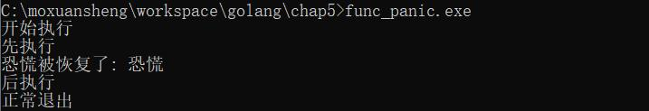

# 第五章、函数

通常函数可以让我们将一个语句序列打包为一个单元，然后可以从程序中其它地方多次调用。函数的机制可以让我们将一个大的工作分解为小的任务，这样的小任务可以让不同程序员在不同时间、不同地方独立完成。

在 Go 语言中，函数是唯一一种基于特定输入，实现特定任务并可返回任务执行结果的代码块（Go 语言中的方法本质上也是函数）

## 5.1 函数声明

函数声明包括函数名、形式参数列表、返回值列表（可省略）以及函数体。

```go
func name(parameter-list) (result-list) {
    body
}
```

形式参数列表描述了函数的参数名以及参数类型。这些参数作为局部变量，其值由参数调用者提供。

如果一组形参或返回值有相同的类型，我们不必为每个形参都写出参数类型。下面2个声明是等价的：

```go
func f(i, j, k int, s, t string)                 { /* ... */ }
func f(i int, j int, k int,  s string, t string) { /* ... */ }
```

**你可能会偶尔遇到没有函数体的函数声明，这表示该函数不是以Go实现的。这样的声明定义了函数签名。**


## 5.2 递归

函数可以是递归的，这意味着函数可以直接或间接的调用自身。


## 5.3 多返回值

在Go中，一个函数可以返回多个值。比如：一个是期望得到的返回值，另一个是函数出错时的错误信息。

准确的变量名可以传达函数返回值的含义。尤其在返回值的类型都相同时，就像下面这样：

```go
func Size(rect image.Rectangle) (width, height int)
func Split(path string) (dir, file string)
func HourMinSec(t time.Time) (hour, minute, second int)
```

如果一个函数所有的返回值都有显式的变量名，那么该函数的return语句可以省略操作数。这称之为bare return。比如：

```
func add(a,b int64) (c ,d int64) {
    x = a + b
    y = a - b
    c = x * 2
    d = y * 2
    return //相当于return c,d 
}
```


**"_"下划线标识符，作用是占位符。如果要调用的函数返回多个值，而又不需要其中的某个值，就可以使用下划线标识符将其忽略。**


## 5.4 错误

对于大部分函数而言，永远无法确保能否成功运行。这是因为错误的原因超出了程序员的控制。

在Go的错误处理中，错误是软件包API和应用程序用户界面的一个重要组成部分，程序运行失败仅被认为是几个预期的结果之一。

对于那些将运行失败看作是预期结果的函数，它们会返回一个额外的返回值，通常是最后一个，来传递错误信息。如果导致失败的原因只有一个，额外的返回值可以是一个布尔值，通常被命名为ok。

内置的error是接口类型。我们将在第七章了解接口类型的含义，以及它对错误处理的影响。现在我们只需要明白error类型可能是nil或者non-nil。nil意味着函数运行成功，non-nil表示失败。对于non-nil的error类型，我们可以通过调用error的Error函数或者输出函数获得字符串类型的错误信息。

```go
fmt.Println(err)
fmt.Printf("%v", err)
```


### 5.4.1 错误处理策略

当一次函数调用返回错误时，调用者应该选择合适的方式处理错误。

- 首先，也是最常用的方式是传播错误。这意味着函数中某个子程序的失败，会变成该函数的失败。
- 如果错误的发生是偶然性的，或由不可预知的问题导致的。一个明智的选择是重新尝试失败的操作。在重试时，我们需要限制重试的时间间隔或重试的次数，防止无限制的重试。
- 如果错误发生后，程序无法继续运行，输出错误信息并结束程序。
- 有时，我们只需要输出错误信息就足够了，不需要中断程序的运行。我们可以通过log包提供函数。
- 我们可以直接忽略掉错误：尽管os.RemoveAll会失败，但上面的例子并没有做错误处理。这是因为操作系统会定期的清理临时目录。


### 5.4.2 文件结尾错误（EOF）

函数经常会返回多种错误，这对终端用户来说可能会很有趣，但对程序而言，这使得情况变得复杂。这会导致调用者必须分别处理由文件结束引起的各种错误。基于这样的原因，io包保证任何由文件结束引起的读取失败都返回同一个错误——io.EOF，该错误在io包中定义：

```go
package io

import "errors"

// EOF is the error returned by Read when no more input is available.
var EOF = errors.New("EOF")
```

## 5.5 函数值

在Go中，函数被看作第一类值（first-class values）：函数像其他值一样，拥有类型，可以被赋值给其他变量，传递给函数，从函数返回。对函数值（function value）的调用类似函数调用。

```go
func square(n int) int { return n * n }
f := square
fmt.Println(f(3)) // "9"
```

函数类型的零值是nil。调用值为nil的函数值会引起panic错误。


## 5.6 匿名函数

拥有函数名的函数只能在包级语法块中被声明，通过函数字面量（function literal），我们可绕过这一限制，在任何表达式中表示一个函数值。函数字面量的语法和函数声明相似，区别在于func关键字后没有函数名。函数值字面量是一种表达式，它的值被称为匿名函数（anonymous function）。


## 5.7 可变参数

在声明可变参数函数时，需要在参数列表的最后一个参数类型之前加上省略符号“...”，这表示该函数会接收任意数量的该类型参数。


## 5.8 Deferred函数

你只需要在调用普通函数或方法前加上关键字defer，就完成了defer所需要的语法。当执行到该条语句时，函数和参数表达式得到计算，但直到包含该defer语句的函数执行完毕时，defer后的函数才会被执行，不论包含defer语句的函数是通过return正常结束，还是由于panic导致的异常结束。

defer语句经常被用于处理成对的操作，如打开、关闭、连接、断开连接、加锁、释放锁。通过defer机制，不论函数逻辑多复杂，都能保证在任何执行路径下，资源被释放。

**类似try catch finally？但是语句的编写更为方便。**

**也不用C语言中goto return了。**


## 5.9 Panic异常和recover恢复

Go的类型系统会在编译时捕获很多错误，但有些错误只能在运行时检查，如数组访问越界、空指针引用等。这些运行时错误会引起painc异常。可以调用内置函数panic来产生一个恐慌以使当前协程进入恐慌状况。

 一旦一个函数调用产生一个恐慌，此函数调用将立即进入它的退出阶段，在此函数调用中被推入堆栈的延迟调用将按照它们被推入的顺序逆序执行。

通过在一个延迟函数调用之中调用内置函数`recover`，当前协程中的一个恐慌可以被消除，从而使得当前协程重新进入正常状况。**在延迟函数中处理了异常，然后恢复，但是不能再执行panic之后的函数语句？？**

函数声明原型如下：

```go
func panic(v interface{})
func recover() interface{}
```

一个`recover`函数的返回值为其所恢复的恐慌在产生时被一个`panic`函数调用所消费的参数。

示例如下：

```go
package main

import "fmt"

func main() {

    defer func() {
        fmt.Println("后执行")
        fmt.Println("正常退出")
    }()
    
    fmt.Println("开始执行")
    
    defer func() {
        v := recover()
        fmt.Println("先执行")
        fmt.Println("恐慌被恢复了:", v)
    }()
    
    panic("恐慌") //产生一个恐慌
    fmt.Println("无法执行")

}
```

panic之后，开始进入退出节点，逆序执行压缩的defer函数。recover返回值为被panic调用所使用的参数。

执行结果如下：




## 5.10 跟踪函数调用链

通过defer函数跟踪函数的执行过程。示例如下：

```go
// trace.go
package main
  
func Trace(name string) func() {
    println("enter:", name)
    return func() {
        println("exit:", name)
    }
}

func foo() {
    defer Trace("foo")()
    bar()
}

func bar() {
    defer Trace("bar")()
}

func main() {
    defer Trace("main")()
    foo()
}
```

运行结果如下：


运行过程：

Go会对defer后面的表达式```Trace("foo")()```进行求值，即：执行Trace函数。

然后返回一个闭包函数，这个闭包函数一旦被执行，就会输出离开某函数的日志。

但是存在如下问题：

- 显式传入要跟踪的函数名；
- 如果是并发应用，不同 Goroutine 中函数链跟踪混在一起无法分辨；
- 输出的跟踪结果缺少层次感，调用关系不易识别；
- 需要跟踪的函数需要手动调用Trace函数。

### 5.10.1 自动获取所跟踪函数的函数名

手动传入函数名的方式：

```go

defer Trace("foo")()
```

如果能够自动获取函数名，则只需要调用Trace()即可，保持一致性。

需要借助runtime包：

```go

// trace1/trace.go

func Trace() func() {
    pc, _, _, ok := runtime.Caller(1)
    if !ok {
        panic("not found caller")
    }

    fn := runtime.FuncForPC(pc)
    name := fn.Name()

    println("enter:", name)
    return func() { println("exit:", name) }
}

func foo() {
    defer Trace()()
    bar()
}

func bar() {
    defer Trace()()
}

func main() {
    defer Trace()()
    foo()
}
```

通过 runtime.Caller 函数获得当前 Goroutine 的函数调用栈上的信息.

runtime.Caller 的参数标识的是要获取的是哪一个栈帧的信息。当参数为 0 时，返回的是 Caller 函数的调用者的函数信息，在这里就是 Trace 函数。但我们需要的是 Trace 函数的调用者的信息，于是我们传入 1。

Caller 函数有四个返回值：第一个返回值代表的是程序计数（pc）；第二个和第三个参数代表对应函数所在的源文件名以及所在行数，这里我们暂时不需要；最后一个参数代表是否能成功获取这些信息，如果获取失败，我们抛出 panic。

基于程序计数器（PC）得到被跟踪函数的函数名称。

### 5.10.2 增加 Goroutine 标识

在输出的函数出入口信息时，带上一个在程序每次执行时能唯一区分 Goroutine 的 Goroutine ID。

但是Go 核心团队为了避免Goroutine 滥用，故意没有将 Goroutine ID 暴露给开发者。但是Go 标准库的 h2_bundle.go中有一个获取方法，可以进行参考使用：

```go

// trace2/trace.go
var goroutineSpace = []byte("goroutine ")

func curGoroutineID() uint64 {
    b := make([]byte, 64)
    b = b[:runtime.Stack(b, false)]
    // Parse the 4707 out of "goroutine 4707 ["
    b = bytes.TrimPrefix(b, goroutineSpace)
    i := bytes.IndexByte(b, ' ')
    if i < 0 {
        panic(fmt.Sprintf("No space found in %q", b))
    }
    b = b[:i]
    n, err := strconv.ParseUint(string(b), 10, 64)
    if err != nil {
        panic(fmt.Sprintf("Failed to parse goroutine ID out of %q: %v", b, err))
    }
    return n
}
```

在 Trace 函数中添加 Goroutine ID 信息的输出：

```go

// trace2/trace.go
func Trace() func() {
    pc, _, _, ok := runtime.Caller(1)
    if !ok {
        panic("not found caller")
    }

    fn := runtime.FuncForPC(pc)
    name := fn.Name()

    gid := curGoroutineID()
    fmt.Printf("g[%05d]: enter: [%s]\n", gid, name)
    return func() { fmt.Printf("g[%05d]: exit: [%s]\n", gid, name) }
}
```


