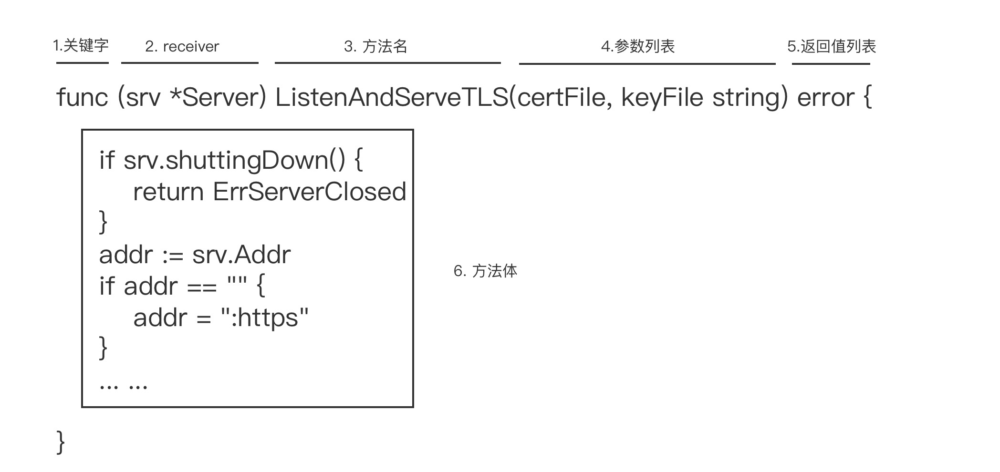

# 6 方法

Go语言从设计伊始，就不支持经典的面向对象语法元素，比如类、对象、继承等等。但保留了名为“方法（method）”的语法元素。方法能给用户定义的类型添加新的行为。

## 6.1 方法声明

在函数声明时，在其名字之前放上一个变量，即是一个方法。形式如下：



这个附加的receiver参数会将该函数附加到这种类型上，类似"this"，**将函数与接收者绑定。**

```go
package geometry

import "math"

type Point struct{ X, Y float64 }

// traditional function
func Distance(p, q Point) float64 {
    return math.Hypot(q.X-p.X, q.Y-p.Y)
}

// same thing, but as a method of the Point type
func (p Point) Distance(q Point) float64 {
    return math.Hypot(q.X-p.X, q.Y-p.Y)
}
```

### 6.1.1 约束

方法接收器（receiver）参数、函数 / 方法参数，以及返回值变量对应的作用域范围，都是函数 / 方法体对应的显式代码块。因此，receiver 部分的参数名不能与方法参数列表中的形参名，以及具名返回值中的变量名存在冲突，必须在这个方法的作用域中具有唯一性。

- receiver 参数的基类型本身不能为指针类型或接口类型；

- 方法声明要与 receiver 参数的基类型声明放在同一个包内；
- 我们不能为原生类型（诸如 int、float64、map 等）添加方法；
- 不能跨越 Go 包为其他包的类型声明新方法。

### 6.1.2 调用

```go
package main

import (
    "fmt"
    _ "io"
)

type T struct{}

func (t T) M(n int) {
    fmt.Println(n)
}

func main() {
    var t T
    t.M(1) // 通过类型T的变量实例调用方法M

    p := &T{}
    p.M(2) // 通过类型*T的变量实例调用方法M
}
```


Go语言中有两种类型的接收者：值接收者和指针接收者。（类似C语言的传值、传地址）

- 如果使用值接收者，调用时会使用这个值的一个副本来执行。
- 如果使用指针接收者，调用时使用实际值来调用方法。

使用值接收者声明的方法：

```go
bill := user{"Bill", "bill@email.com"}
bill.notify()
```

使用 bill 的值作为接收者进行调用，方法 notify 会接收到 bill的值的一个副本。**对于副本的修改，不会体现到原有值当中**。

也可以使用指针来调用使用值接收者声明的方法：

```go
lisa := &user{"Lisa", "lisa@email.com"}
lisa.notify()
```

lisa指向user类型值的指针。实际上Go在代码背后执行的代码：

```go
(*lisa).notify()
```

指针被解引用为值， 这样就符合了值接收者的要求。notify操作的是一个副本。	


