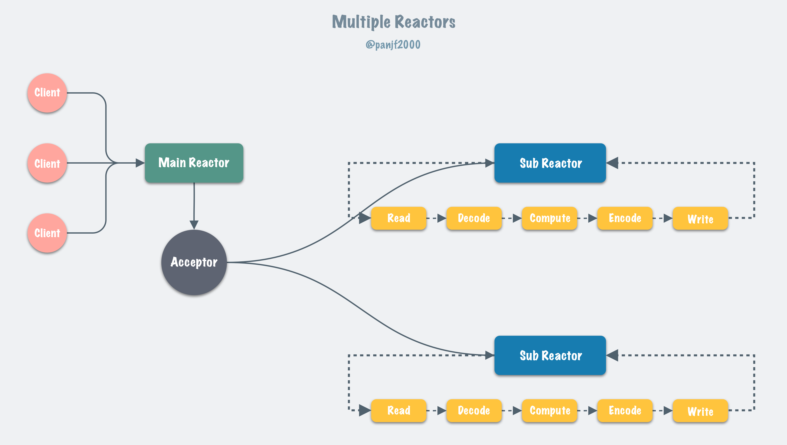
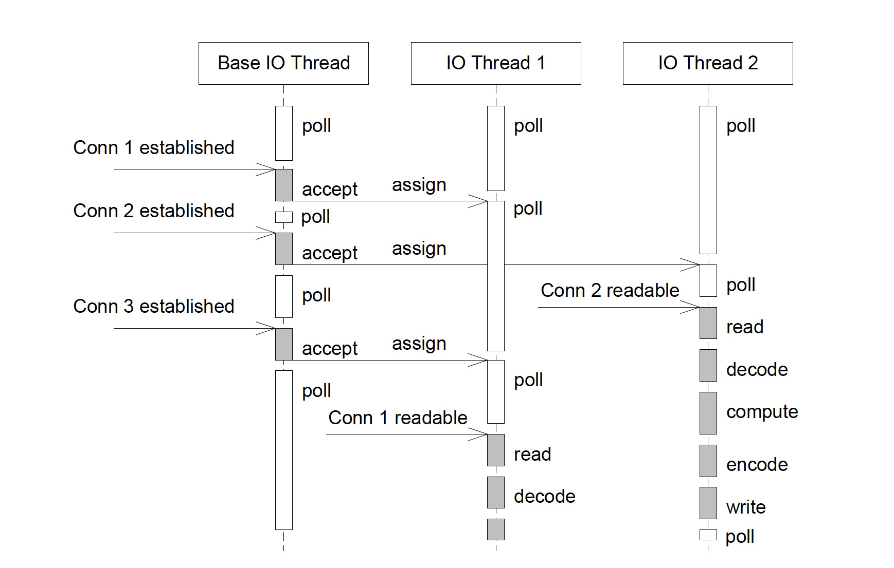
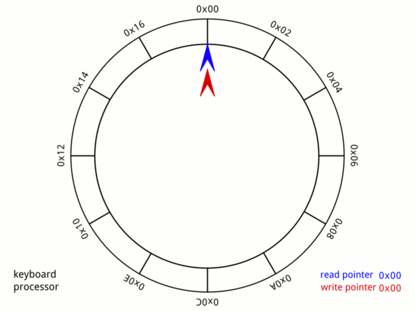

# 1、简介

[gnet](https://github.com/panjf2000/gnet) 是一个基于事件驱动的高性能和轻量级网络框架。基本特性：

- 直接使用了epoll和kqueue系统调用而非标准Go网络包；
- 类似netty或者libuv网络库，使得gnet到达了一个远超Go net的性能表现，不是为了取代Go的网络标准库，而是为了创造出高效处理网络包的Go语言网络服务器框架。

功能：

- 高性能的基于多线程/Go程网络模型的 event-loop 事件驱动；
- 内置 bytes 内存池，由开源库 bytebufferpool 提供支持；
- 整个生命周期是无锁的；
- 高效、可重用而且自动伸缩的环形内存 buffer；
-  灵活的事件定时器；
- 内置多种编解码器，支持对 TCP 数据流分包：LineBasedFrameCodec, DelimiterBasedFrameCodec, FixedLengthFrameCodec 和 LengthFieldBasedFrameCodec，参考自 [netty codec](https://netty.io/4.1/api/io/netty/handler/codec/package-summary.html)，而且支持自定制编解码器。

# 2、核心设计

## 2.1 多线程模型

gnet重新设计开发了内置的多线程/Go网络模型：【主从多Reactor】，这也是netty默认的多线程网络模型：



运行时序图：




## 2.2 可重用且自动扩容的 Ring-Buffer

gnet内置了inbound 和 outbound 两个 buffers，基于 Ring-Buffer 原理实现，分别用来缓冲输入输出的网络数据以及管理内存，gnet 里面的 ring buffer 能够重用内存以及按需扩容。

对于 TCP 协议的流数据，使用 gnet 不需要业务方为了解析应用层协议而自己维护和管理 buffers，gnet 会替业务方完成缓冲和管理网络数据的任务，降低业务代码的复杂性以及降低开发者的心智负担，使得开发者能够专注于业务逻辑而非一些底层实现。



# 3、开始使用

用 `gnet` 来构建网络服务器是非常简单的，只需要实现 `gnet.EventHandler`接口然后把你关心的事件函数注册到里面，最后把它连同监听地址一起传递给 `gnet.Serve` 函数就完成了。在服务器开始工作之后，每一条到来的网络连接会在各个事件之间传递，如果你想在某个事件中关闭某条连接或者关掉整个服务器的话，直接在事件函数里把 `gnet.Action` 设置成 `Close` 或者 `Shutdown` 就行了。


## 3.1 不带阻塞的echo服务器

 [参见示例代码](gnet源码分析/echodemo/echodemo.go)：

```go
package main

import (
    "log"
    "github.com/panjf2000/gnet"
)

type echoServer struct {
    *gnet.EventServer
}

func (es *echoServer) React(frame [] byte, c gnet.Conn) (out []byte, action gnet.Action){
    out = frame
    return
}

func main() {
    echo := new(echoServer)
    log.Fatal(gnet.Serve(echo,"tcp://:9000", gnet.WithMulticore(true)))
}
```

注册了一个 `EventHandler.React` 事件，主要的业务逻辑代码会写在这个事件方法里，这个方法会在服务器接收到客户端写过来的数据之时被调用。

此时的输入参数已经是解码过后的一个完整的网络数据包，通常需要实现 `gnet` 的 [codec 接口](https://pkg.go.dev/github.com/panjf2000/gnet?tab=doc#ICodec)作为你自己的业务编解码器来处理 TCP 组包和分包的问题，如果你不实现那个接口的话，那么 `gnet` 将会使用[默认的 codec](https://pkg.go.dev/github.com/panjf2000/gnet?tab=doc#BuiltInFrameCodec)，这意味着在 `EventHandler.React` 被触发调用之时输入参数: `frame` 里存储的是所有网络数据：包括最新的以及还在 buffer 里的旧数据，然后处理输入数据（这里只是把数据 echo 回去）并且在处理完之后把需要输出的数据赋值给 `out` 变量并返回，接着输出的数据会经过编码，最后被写回客户端。

**主要是分切片的数据，需要实现codec接口。**


## 3.2 带阻塞逻辑的echo服务器

[参见示例程序](gnet源码分析/blockechodemo/blockechodemo.go):

```go
package main

import (
    "log"
    "time"

    "github.com/panjf2000/gnet"
    "github.com/panjf2000/gnet/pool/goroutine"
)

type echoServer struct {
    //嵌入类型
    *gnet.EventServer
    pool *goroutine.Pool
}

func (es *echoServer) React(frame []byte, c gnet.Conn) (out []byte, action gnet.Action) {
    //增加数据
    data := append([]byte{}, frame...)
    //通过独立的协程运行
    // Use ants pool to unblock the event-loop.
    _ = es.pool.Submit(func() {
        //业务逻辑中有阻塞代码。放入到协程中运行
        time.Sleep(1 * time.Second)
        c.AsyncWrite(data)
    })

    return
}

func main() {
    p := goroutine.Default()
    defer p.Release()

    echo := &echoServer{pool: p}
    log.Fatal(gnet.Serve(echo, "tcp://:9000", gnet.WithMulticore(true)))
}
```


但是要注意一点，如果你的服务器处理的流量足够的大，那么这种做法将会导致创建大量的 goroutines 极大地消耗系统资源，所以我一般建议你用 goroutine pool 来做 goroutines 的复用和管理，以及节省系统资源。